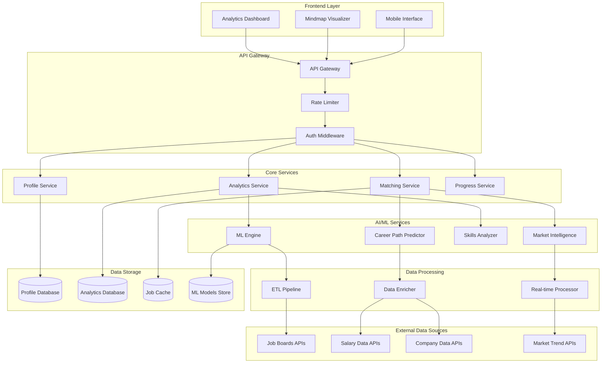
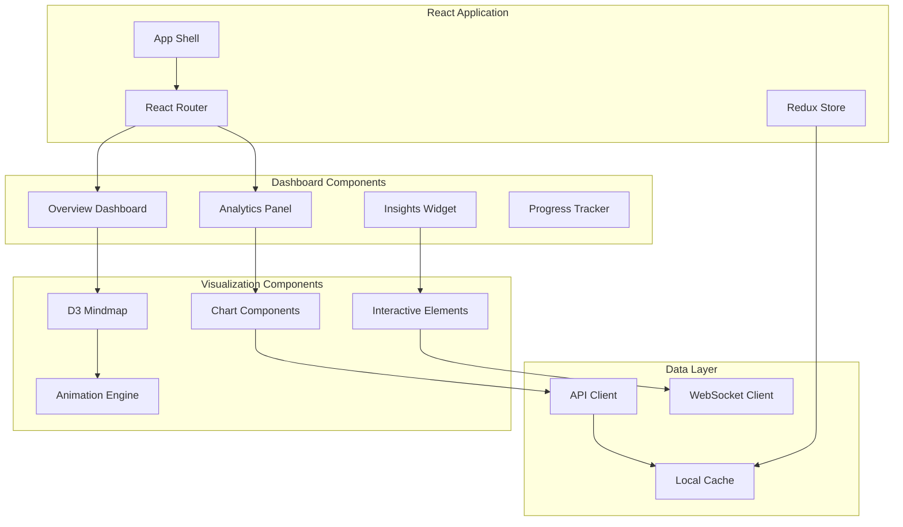

# Job Seeker Profile & Analytics Dashboard Design

## Overview

The Job Seeker Profile & Analytics Dashboard is designed as a real-time, data-driven system that transforms career data into actionable insights through interactive visualizations and AI-powered analytics. The system combines modern web technologies for rich user interfaces with machine learning services for intelligent recommendations, creating a differentiated career intelligence platform.

## Architecture

### High-Level Architecture



### Frontend Architecture

The frontend uses a modern React-based architecture with specialized visualization components:



## Components and Interfaces

### Profile Analytics Engine

**Responsibilities:**
- Career data processing and analysis
- Profile strength scoring and benchmarking
- Market positioning analysis
- Recommendation generation

**Key APIs:**
```typescript
interface ProfileAnalyticsService {
  analyzeProfile(userId: string): Promise<ProfileAnalysis>
  calculateStrengthScore(profile: UserProfile): Promise<StrengthScore>
  generateRecommendations(userId: string): Promise<Recommendation[]>
  benchmarkProfile(userId: string, criteria: BenchmarkCriteria): Promise<BenchmarkResult>
  getMarketPosition(userId: string): Promise<MarketPosition>
}

interface ProfileAnalysis {
  strengthScore: number
  completenessScore: number
  marketPosition: MarketPosition
  skillGaps: SkillGap[]
  recommendations: Recommendation[]
  competitiveAdvantages: string[]
  improvementAreas: ImprovementArea[]
}
```

### Mindmap Visualizer Service

**Responsibilities:**
- Interactive mindmap generation and rendering
- Real-time visualization updates
- User interaction handling
- Export and sharing capabilities

**Key APIs:**
```typescript
interface MindmapVisualizerService {
  generateMindmapData(userId: string, type: MindmapType): Promise<MindmapData>
  updateVisualization(userId: string, changes: ProfileChange[]): Promise<void>
  exportVisualization(userId: string, format: ExportFormat): Promise<ExportResult>
  getInteractionAnalytics(userId: string): Promise<InteractionMetrics>
}

interface MindmapData {
  nodes: MindmapNode[]
  edges: MindmapEdge[]
  layout: LayoutConfig
  styling: StyleConfig
  metadata: VisualizationMetadata
}

interface MindmapNode {
  id: string
  type: 'skill' | 'experience' | 'opportunity' | 'goal'
  label: string
  value: number
  position: { x: number; y: number }
  styling: NodeStyle
  data: any
}
```

### Career Path Predictor

**Responsibilities:**
- ML-powered career trajectory analysis
- Market trend integration
- Success probability calculation
- Timeline and milestone prediction

**Key APIs:**
```typescript
interface CareerPathPredictorService {
  predictCareerPaths(userId: string): Promise<CareerPath[]>
  analyzePathViability(path: CareerPath, market: MarketConditions): Promise<ViabilityAnalysis>
  generateMilestones(path: CareerPath): Promise<Milestone[]>
  calculateSuccessProbability(userId: string, path: CareerPath): Promise<number>
}

interface CareerPath {
  id: string
  title: string
  description: string
  steps: CareerStep[]
  timeline: Timeline
  requirements: Requirement[]
  successProbability: number
  marketDemand: number
  salaryProjection: SalaryRange
}
```

### Opportunity Matcher

**Responsibilities:**
- Job opportunity analysis and scoring
- Real-time matching and notifications
- Application tracking and optimization
- Company and role insights

**Key APIs:**
```typescript
interface OpportunityMatcherService {
  matchOpportunities(userId: string, criteria?: MatchCriteria): Promise<JobMatch[]>
  analyzeOpportunity(userId: string, jobId: string): Promise<OpportunityAnalysis>
  trackApplication(userId: string, applicationData: ApplicationData): Promise<void>
  getMatchingInsights(userId: string): Promise<MatchingInsights>
}

interface JobMatch {
  jobId: string
  title: string
  company: string
  matchScore: number
  matchReasons: MatchReason[]
  skillGaps: SkillGap[]
  salaryMatch: SalaryComparison
  locationMatch: LocationMatch
  cultureMatch: CultureMatch
}
```

## Data Models

### User Profile Document (MongoDB)

```typescript
interface UserProfileDocument {
  _id: ObjectId
  userId: string
  
  // Basic Information
  personalInfo: {
    firstName: string
    lastName: string
    email: string
    phone?: string
    location: Location
    profilePicture?: string
    linkedInUrl?: string
    portfolioUrl?: string
  }
  
  // Professional Experience
  experience: Array<{
    id: string
    title: string
    company: string
    startDate: Date
    endDate?: Date
    description: string
    skills: string[]
    achievements: string[]
    industry: string
  }>
  
  // Skills and Competencies
  skills: Array<{
    name: string
    category: 'technical' | 'soft' | 'industry'
    proficiencyLevel: number // 1-10
    yearsExperience: number
    certifications: string[]
    endorsements: number
    lastUsed: Date
  }>
  
  // Education
  education: Array<{
    institution: string
    degree: string
    field: string
    graduationDate: Date
    gpa?: number
    honors?: string[]
  }>
  
  // Career Goals and Preferences
  careerGoals: {
    targetRoles: string[]
    targetIndustries: string[]
    targetCompanies: string[]
    salaryRange: SalaryRange
    locationPreferences: LocationPreference[]
    workArrangement: 'remote' | 'hybrid' | 'onsite' | 'flexible'
    careerTimeline: Timeline
  }
  
  // Analytics and Insights
  analytics: {
    profileStrength: number
    completenessScore: number
    marketPosition: string
    lastAnalyzed: Date
    trendingSkills: string[]
    skillGaps: SkillGap[]
    careerPathRecommendations: string[]
  }
  
  // Activity and Engagement
  activity: {
    lastLogin: Date
    profileViews: number
    searchAppearances: number
    applicationsSent: number
    interviewsReceived: number
    offersReceived: number
  }
  
  // Privacy and Visibility Settings
  privacy: {
    profileVisibility: 'public' | 'recruiter' | 'private'
    allowRecruiterContact: boolean
    showSalaryExpectations: boolean
    shareAnalytics: boolean
  }
  
  // Metadata
  createdAt: Date
  updatedAt: Date
  lastSyncedAt?: Date
  dataSource: 'manual' | 'linkedin' | 'resume' | 'imported'
}
```

### Analytics Data (InfluxDB Time-Series)

```typescript
interface AnalyticsMetrics {
  // Profile Metrics
  profileStrengthHistory: TimeSeries<number>
  skillDevelopmentProgress: TimeSeries<SkillProgress>
  marketPositionChanges: TimeSeries<MarketPosition>
  
  // Engagement Metrics
  dashboardViews: TimeSeries<number>
  mindmapInteractions: TimeSeries<InteractionEvent>
  featureUsage: TimeSeries<FeatureUsage>
  
  // Job Search Metrics
  jobSearchActivity: TimeSeries<SearchEvent>
  applicationSuccess: TimeSeries<ApplicationOutcome>
  interviewConversion: TimeSeries<ConversionMetric>
  
  // Market Intelligence
  industryTrends: TimeSeries<TrendData>
  salaryBenchmarks: TimeSeries<SalaryData>
  skillDemandChanges: TimeSeries<SkillDemand>
}
```

## Technology Stack

### Frontend Technologies
- **Framework**: React 18 with TypeScript
- **State Management**: Redux Toolkit with RTK Query
- **Visualization**: D3.js v7 for mindmaps, Chart.js for analytics
- **UI Components**: Material-UI with custom design system
- **Animation**: Framer Motion for smooth transitions
- **Real-time**: Socket.io client for live updates

### Backend Services
- **Runtime**: Node.js with TypeScript
- **Framework**: Express.js with OpenAPI specification
- **Document Database**: MongoDB for profile and configuration data
- **Time-Series Database**: InfluxDB for analytics and metrics
- **Cache**: Redis for session data and frequently accessed computations
- **Message Queue**: Apache Kafka for event streaming and ML pipeline triggers

### Machine Learning Stack
- **ML Framework**: Python with scikit-learn and TensorFlow
- **Feature Store**: Feast for ML feature management
- **Model Serving**: TensorFlow Serving with REST API
- **Pipeline Orchestration**: Apache Airflow for ML workflows
- **Experiment Tracking**: MLflow for model versioning and experiments

### External Integrations
- **Job Data**: Indeed API, LinkedIn Jobs API, Glassdoor API
- **Salary Data**: PayScale API, Salary.com API, Glassdoor Salaries
- **Company Data**: Clearbit API, Crunchbase API, LinkedIn Company API
- **Market Intelligence**: Bureau of Labor Statistics API, O*NET API

## Performance Optimization

### Frontend Performance
- **Code Splitting**: Lazy loading of visualization components
- **Virtualization**: React Window for large data sets
- **Memoization**: React.memo and useMemo for expensive calculations
- **Caching**: Service Worker for offline analytics viewing
- **Bundle Optimization**: Webpack optimization for D3.js tree-shaking

### Backend Performance
- **Caching Strategy**: Multi-level caching with Redis and MongoDB
- **Database Optimization**: Strategic indexing and aggregation pipelines
- **API Optimization**: GraphQL for flexible data fetching
- **Async Processing**: Background jobs for ML computations
- **CDN**: CloudFront for static assets and cached API responses

### ML Performance
- **Model Optimization**: Quantization and pruning for faster inference
- **Batch Processing**: Efficient batch prediction for multiple users
- **Feature Caching**: Pre-computed features for common queries
- **Model Serving**: Horizontal scaling of prediction services
- **Pipeline Optimization**: Parallel processing of data enrichment

## Real-time Features

### WebSocket Integration
- **Live Profile Updates**: Real-time mindmap updates as profile changes
- **Market Alerts**: Instant notifications for relevant opportunities
- **Analytics Streaming**: Live dashboard updates with new data
- **Collaboration**: Shared viewing sessions for career coaching

### Event-Driven Architecture
- **Profile Events**: Skill additions, experience updates, goal changes
- **Market Events**: New job postings, salary updates, trend changes
- **Analytics Events**: Insight generation, recommendation updates
- **User Events**: Dashboard interactions, feature usage, engagement

## Security and Privacy

### Data Protection
- **Encryption**: AES-256 for sensitive profile data at rest
- **API Security**: JWT tokens with short expiration and refresh
- **Input Validation**: Comprehensive sanitization and validation
- **Rate Limiting**: Aggressive rate limiting for analytics endpoints

### Privacy Controls
- **Granular Permissions**: Fine-grained control over data visibility
- **Data Anonymization**: Anonymous benchmarking and market analysis
- **GDPR Compliance**: Right to deletion and data portability
- **Audit Logging**: Complete audit trail for data access and changes

## Scalability Considerations

### Horizontal Scaling
- **Microservices**: Independent scaling of analytics and visualization services
- **Database Sharding**: User-based sharding for profile data
- **ML Scaling**: Auto-scaling prediction services based on demand
- **CDN Distribution**: Global distribution of visualization assets

### Performance Monitoring
- **Real-time Metrics**: Dashboard performance and user experience metrics
- **ML Monitoring**: Model performance and drift detection
- **Business Metrics**: User engagement and feature adoption tracking
- **Alert Management**: Proactive alerting for performance degradation