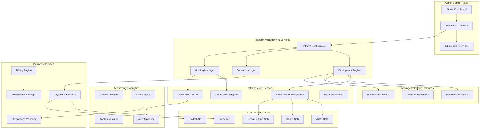

# Platform Administrator Setup System Design

## Overview

The Platform Administrator Setup System is designed as a control plane that manages the lifecycle of Cleansheet platform instances. It provides infrastructure-as-code capabilities, multi-cloud deployment support, and comprehensive administrative controls for managing tenants, billing, and platform configuration. The system follows a microservices architecture with strong separation between control plane and data plane operations.

## Architecture

### High-Level Architecture



### Service Architecture

The system is composed of several key service domains:

1. **Platform Management**: Core orchestration and configuration services
2. **Infrastructure Management**: Cloud provisioning and resource management
3. **Business Management**: Billing, payments, and compliance
4. **Monitoring & Analytics**: Observability and business intelligence
5. **Multi-Cloud Abstraction**: Unified interface across cloud providers

## Components and Interfaces

### Platform Configurator Service

**Responsibilities:**
- Platform instance lifecycle management
- Configuration template management
- Environment promotion and rollback
- Feature flag and configuration distribution

**Key APIs:**
```typescript
interface PlatformConfiguratorService {
  createInstance(config: PlatformConfig): Promise<PlatformInstance>
  updateInstance(instanceId: string, updates: Partial<PlatformConfig>): Promise<void>
  deployInstance(instanceId: string, environment: Environment): Promise<DeploymentResult>
  rollbackInstance(instanceId: string, version: string): Promise<void>
  getInstanceStatus(instanceId: string): Promise<InstanceStatus>
}
```

### Deployment Engine Service

**Responsibilities:**
- Infrastructure provisioning orchestration
- Application deployment automation
- Blue-green deployment management
- Rollback and disaster recovery

**Key APIs:**
```typescript
interface DeploymentEngineService {
  provisionInfrastructure(spec: InfrastructureSpec): Promise<ProvisioningResult>
  deployApplication(instanceId: string, version: string): Promise<DeploymentResult>
  scaleResources(instanceId: string, scaling: ScalingConfig): Promise<void>
  executeRollback(instanceId: string, targetVersion: string): Promise<RollbackResult>
}
```

### Tenant Manager Service

**Responsibilities:**
- Multi-tenant organization management
- Resource quota enforcement
- Tenant isolation and security
- Onboarding and offboarding workflows

**Key APIs:**
```typescript
interface TenantManagerService {
  createTenant(tenantData: TenantConfig): Promise<Tenant>
  configureTenant(tenantId: string, config: TenantSettings): Promise<void>
  setResourceQuotas(tenantId: string, quotas: ResourceQuotas): Promise<void>
  suspendTenant(tenantId: string, reason: string): Promise<void>
  getTenantMetrics(tenantId: string): Promise<TenantMetrics>
}
```

### Payment Processor Service

**Responsibilities:**
- Multi-gateway payment processing
- Subscription lifecycle management
- PCI compliance and tokenization
- Billing automation and invoicing

**Key APIs:**
```typescript
interface PaymentProcessorService {
  setupPaymentMethod(customerId: string, paymentData: PaymentMethod): Promise<PaymentMethodResult>
  processPayment(paymentIntent: PaymentIntent): Promise<PaymentResult>
  createSubscription(subscriptionData: SubscriptionConfig): Promise<Subscription>
  handleWebhook(provider: string, payload: WebhookPayload): Promise<void>
}
```

## Data Storage Strategy

### Document-Centric Design Benefits

**Flexibility**: Configuration schemas can evolve without migrations. New tenant settings, platform features, and integration options can be added seamlessly.

**Performance**: Related data is co-located in documents, reducing joins and improving read performance for complex configuration queries.

**Developer Experience**: JSON documents map naturally to TypeScript interfaces and API payloads, eliminating object-relational impedance mismatch.

**Operational Simplicity**: Fewer database systems to manage for most use cases, with structured data only where regulatory compliance demands it.

### Hybrid Approach Rationale

### Document Store (MongoDB)
**Platform Instances, Tenants, Configurations**
- Flexible schema evolution for configuration changes
- Natural JSON structure for API responses
- Embedded documents for related data (config within instance)
- Atomic updates for configuration changes

### Relational Database (PostgreSQL)
**Financial and Billing Data Only**
- ACID transactions for payment processing
- Regulatory compliance and audit requirements
- Complex financial calculations and reporting
- Integration with payment gateways

### Time-Series Database (InfluxDB)
**Metrics and Monitoring Data**
- High-performance ingestion of monitoring data
- Efficient storage and querying of time-based metrics
- Automatic data retention and downsampling
- Integration with Grafana for visualization

### File-Based Storage
**Infrastructure State and Templates**
- Terraform state files in cloud storage (S3/Azure Blob)
- Configuration templates in Git repositories
- Deployment artifacts and container images
- Backup and disaster recovery data

## Data Models

### Platform Instance Document (MongoDB)

```typescript
interface PlatformInstanceDocument {
  _id: ObjectId
  instanceId: string
  name: string
  description: string
  environment: 'development' | 'staging' | 'production'
  cloudProvider: 'aws' | 'azure' | 'gcp'
  region: string
  
  // Embedded configuration document
  configuration: {
    compute: {
      instanceType: string
      minInstances: number
      maxInstances: number
      autoScaling: boolean
    }
    storage: {
      type: 'ssd' | 'hdd' | 'nvme'
      size: number
      backupEnabled: boolean
      retentionDays: number
    }
    networking: {
      vpc: string
      subnets: string[]
      loadBalancer: boolean
      ssl: boolean
    }
    security: {
      encryption: boolean
      mfa: boolean
      ipWhitelist: string[]
      complianceLevel: string
    }
    features: Record<string, boolean>
    integrations: Record<string, any>
  }
  
  // Current status and metadata
  status: {
    state: 'provisioning' | 'active' | 'updating' | 'error' | 'terminated'
    health: 'healthy' | 'degraded' | 'unhealthy'
    lastHealthCheck: Date
    errorMessage?: string
  }
  
  resources: {
    allocated: {
      cpu: number
      memory: number
      storage: number
      bandwidth: number
    }
    actual: {
      cpu: number
      memory: number
      storage: number
      bandwidth: number
    }
    estimatedMonthlyCost: number
  }
  
  // Audit trail
  createdAt: Date
  updatedAt: Date
  lastDeployedAt?: Date
  deploymentHistory: Array<{
    version: string
    deployedAt: Date
    deployedBy: string
    status: 'success' | 'failed' | 'rolled_back'
  }>
}
```

### Tenant Document (MongoDB)

```typescript
interface TenantDocument {
  _id: ObjectId
  tenantId: string
  organizationName: string
  domain: string
  adminEmail: string
  
  // Subscription reference (detailed data in PostgreSQL)
  subscription: {
    subscriptionId: string
    tier: string
    status: 'active' | 'suspended' | 'pending' | 'terminated'
    expiresAt: Date
  }
  
  // Resource quotas and limits
  quotas: {
    maxUsers: number
    maxStorage: number
    maxAPICallsPerMonth: number
    maxComputeHours: number
    features: string[]
    customLimits: Record<string, number>
  }
  
  // Tenant-specific settings
  settings: {
    branding: {
      logo?: string
      primaryColor: string
      secondaryColor: string
      customDomain?: string
    }
    authentication: {
      providers: Array<{
        type: 'saml' | 'oidc' | 'oauth'
        name: string
        config: Record<string, any>
        enabled: boolean
      }>
      passwordPolicy: {
        minLength: number
        requireSpecialChars: boolean
        requireNumbers: boolean
        maxAge: number
      }
      mfaRequired: boolean
    }
    integrations: {
      enabled: string[]
      configurations: Record<string, any>
    }
    compliance: {
      dataResidency: string
      retentionPeriod: number
      auditLevel: 'basic' | 'enhanced' | 'comprehensive'
      gdprCompliant: boolean
    }
  }
  
  // Usage tracking (current period)
  currentUsage: {
    users: number
    storageUsed: number
    apiCallsThisMonth: number
    computeHoursThisMonth: number
    lastUpdated: Date
  }
  
  // Audit and metadata
  status: 'active' | 'suspended' | 'pending' | 'terminated'
  createdAt: Date
  updatedAt: Date
  lastActivityAt: Date
}
```

### Financial Data (PostgreSQL)

```typescript
// Keep financial data in PostgreSQL for ACID compliance
interface Subscription {
  id: string
  tenant_id: string
  stripe_subscription_id?: string
  paypal_subscription_id?: string
  tier: string
  status: 'active' | 'past_due' | 'canceled' | 'trialing'
  current_period_start: Date
  current_period_end: Date
  trial_end?: Date
  created_at: Date
  updated_at: Date
}

interface Payment {
  id: string
  subscription_id: string
  amount: number
  currency: string
  status: 'pending' | 'succeeded' | 'failed'
  gateway: 'stripe' | 'paypal'
  gateway_payment_id: string
  processed_at: Date
  created_at: Date
}

interface Invoice {
  id: string
  subscription_id: string
  amount_due: number
  amount_paid: number
  currency: string
  status: 'draft' | 'open' | 'paid' | 'void'
  due_date: Date
  paid_at?: Date
  created_at: Date
}
```

## Technology Stack

### Backend Services
- **Runtime**: Node.js with TypeScript
- **Framework**: Express.js with OpenAPI specification
- **Document Store**: MongoDB for configuration, tenant, and platform data
- **Payment Database**: PostgreSQL for billing/financial data (ACID compliance required)
- **Time-Series**: InfluxDB for metrics and monitoring data
- **Cache**: Redis for sessions and frequently accessed data
- **Message Queue**: Apache Kafka for event streaming and async processing
- **Infrastructure as Code**: Terraform with state stored in cloud backends

### Infrastructure Management
- **Multi-Cloud SDK**: Custom abstraction layer over cloud provider SDKs
- **AWS**: CDK for infrastructure, EKS for container orchestration
- **Azure**: ARM templates, AKS for containers
- **Google Cloud**: Deployment Manager, GKE for containers
- **State Management**: Terraform state in cloud backends (S3, Azure Blob, GCS)
- **Configuration**: Git-based configuration management with GitOps workflows
- **Monitoring**: Prometheus + Grafana, managed logging services

### Payment Processing
- **Primary Gateway**: Stripe for credit cards and subscriptions
- **Secondary Gateway**: PayPal for alternative payment methods
- **Enterprise Billing**: Integration with Zuora for complex billing scenarios
- **Compliance**: PCI DSS Level 1 compliance through tokenization

### Security
- **Secrets Management**: HashiCorp Vault for sensitive configuration
- **Certificate Management**: Let's Encrypt with automatic renewal
- **Network Security**: VPC isolation, WAF protection
- **Compliance**: SOC 2 Type II, GDPR, HIPAA compliance frameworks

## Error Handling

### Infrastructure Provisioning Errors
- Cloud API failures: Implement exponential backoff with circuit breaker
- Resource quota exceeded: Provide clear error messages and upgrade paths
- Network connectivity issues: Retry with different availability zones
- Terraform state conflicts: Implement state locking and conflict resolution

### Payment Processing Errors
- Gateway failures: Automatic failover to secondary payment processor
- Declined payments: Implement dunning management with retry schedules
- Webhook delivery failures: Implement reliable delivery with dead letter queues
- PCI compliance violations: Immediate alert and automatic remediation

### Deployment Errors
- Application startup failures: Automatic rollback to previous version
- Health check failures: Gradual traffic shifting with monitoring
- Database migration errors: Rollback capability with data integrity checks
- Configuration errors: Validation before deployment with dry-run capability

## Testing Strategy

### Infrastructure Testing
- Terraform plan validation and cost estimation
- Multi-cloud deployment testing in isolated environments
- Disaster recovery and backup restoration testing
- Performance testing under various load conditions

### Integration Testing
- Payment gateway integration with test transactions
- Cloud provider API integration with sandbox environments
- Webhook delivery and processing validation
- End-to-end tenant provisioning workflows

### Security Testing
- Penetration testing for admin interfaces
- PCI compliance validation for payment flows
- Multi-tenant isolation verification
- Secrets management and rotation testing

### Business Logic Testing
- Billing calculation accuracy and edge cases
- Subscription lifecycle management
- Resource quota enforcement
- Compliance reporting accuracy

## Deployment Strategy

### Control Plane Deployment
- **High Availability**: Multi-region deployment with active-passive failover
- **Blue-Green Deployment**: Zero-downtime updates for admin services
- **Canary Releases**: Gradual rollout of new features with monitoring
- **Rollback Strategy**: Automated rollback on health check failures

### Platform Instance Management
- **Infrastructure as Code**: All infrastructure defined in version-controlled templates
- **Immutable Infrastructure**: Replace rather than update infrastructure components
- **Environment Promotion**: Automated promotion from dev → staging → production
- **Compliance Validation**: Automated compliance checks before production deployment

## Scalability Considerations

### Horizontal Scaling
- **Microservices Architecture**: Independent scaling of service components
- **Event-Driven Architecture**: Asynchronous processing with message queues
- **Document Sharding**: MongoDB sharding by tenant ID for horizontal scaling
- **Financial Data Isolation**: Separate PostgreSQL instances per region for compliance
- **CDN Integration**: Global content delivery for admin interfaces

### Performance Optimization
- **Caching Strategy**: Redis for frequently accessed documents and API responses
- **Connection Pooling**: Efficient MongoDB and PostgreSQL connection management
- **Document Indexing**: Strategic MongoDB indexes for query performance
- **Batch Processing**: Bulk operations for billing and resource management
- **Lazy Loading**: On-demand resource provisioning to reduce costs
- **Read Replicas**: MongoDB read replicas for analytics and reporting queries

### Cost Optimization
- **Resource Right-Sizing**: Automatic scaling based on actual usage patterns
- **Reserved Instances**: Long-term commitments for predictable workloads
- **Spot Instances**: Cost-effective compute for non-critical batch processing
- **Multi-Cloud Arbitrage**: Optimal cloud provider selection based on cost and performance