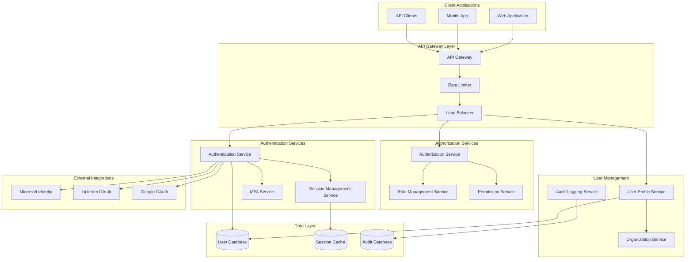

# User Authentication & Authorization System Design

## Overview

The User Authentication & Authorization System is designed as a microservices-based solution that provides secure, scalable identity and access management for the Cleansheet platform. The system supports multi-tenancy, role-based access control, and integration with external identity providers while maintaining high availability and security standards.

## Architecture

### High-Level Architecture



### Service Architecture

The system follows a microservices architecture with the following core services:

1. **Authentication Service**: Handles user login, password management, and external OAuth flows
2. **Authorization Service**: Manages permissions, roles, and access control decisions
3. **User Profile Service**: Manages user data, preferences, and profile information
4. **Session Management Service**: Handles JWT token creation, validation, and refresh
5. **Audit Logging Service**: Captures and stores all security-related events

## Components and Interfaces

### Authentication Service

**Responsibilities:**
- User credential validation
- OAuth 2.0 integration with external providers
- Multi-factor authentication orchestration
- Account lockout and security policies

**Key APIs:**
```typescript
interface AuthenticationService {
  authenticate(credentials: LoginCredentials): Promise<AuthResult>
  authenticateOAuth(provider: string, code: string): Promise<AuthResult>
  initiatePasswordReset(email: string): Promise<void>
  validateMFA(token: string, code: string): Promise<boolean>
  lockAccount(userId: string, reason: string): Promise<void>
}
```

### Authorization Service

**Responsibilities:**
- Permission evaluation and enforcement
- Role-based access control
- Organization-level data isolation
- API access control

**Key APIs:**
```typescript
interface AuthorizationService {
  checkPermission(userId: string, resource: string, action: string): Promise<boolean>
  getUserRoles(userId: string, organizationId: string): Promise<Role[]>
  assignRole(userId: string, roleId: string, organizationId: string): Promise<void>
  createAPIKey(userId: string, permissions: string[]): Promise<APIKey>
}
```

### User Profile Service

**Responsibilities:**
- User profile data management
- LinkedIn integration for profile import
- Privacy controls and data visibility
- Profile completion guidance

**Key APIs:**
```typescript
interface UserProfileService {
  createProfile(userData: UserData): Promise<UserProfile>
  updateProfile(userId: string, updates: Partial<UserProfile>): Promise<UserProfile>
  importFromLinkedIn(userId: string, linkedInToken: string): Promise<void>
  setPrivacySettings(userId: string, settings: PrivacySettings): Promise<void>
}
```

## Data Models

### User Profile Schema

```typescript
interface UserProfile {
  id: string
  organizationId: string
  email: string
  firstName: string
  lastName: string
  profilePicture?: string
  linkedInProfile?: string
  roles: string[]
  preferences: UserPreferences
  privacySettings: PrivacySettings
  createdAt: Date
  updatedAt: Date
  lastLoginAt?: Date
}

interface UserPreferences {
  theme: 'light' | 'dark'
  notifications: NotificationSettings
  language: string
  timezone: string
}

interface PrivacySettings {
  profileVisibility: 'public' | 'organization' | 'private'
  allowRecruiterContact: boolean
  shareAnalytics: boolean
}
```

### Role and Permission Schema

```typescript
interface Role {
  id: string
  name: string
  description: string
  organizationId: string
  permissions: Permission[]
  isSystemRole: boolean
}

interface Permission {
  id: string
  resource: string
  action: string
  conditions?: PermissionCondition[]
}

interface PermissionCondition {
  field: string
  operator: 'equals' | 'contains' | 'in'
  value: any
}
```

## Technology Stack

### Backend Services
- **Runtime**: Node.js with TypeScript
- **Framework**: Express.js with Helmet for security
- **Database**: PostgreSQL for user data, Redis for session caching
- **Authentication**: Passport.js for OAuth integrations
- **JWT**: jsonwebtoken library with RS256 signing
- **Validation**: Joi for input validation
- **Logging**: Winston with structured logging

### Infrastructure
- **Cloud Provider**: AWS (recommended for scalability and security features)
- **Container Orchestration**: Amazon EKS (Kubernetes)
- **API Gateway**: AWS API Gateway with AWS WAF
- **Load Balancing**: Application Load Balancer
- **Caching**: Amazon ElastiCache (Redis)
- **Database**: Amazon RDS (PostgreSQL) with read replicas
- **Secrets Management**: AWS Secrets Manager
- **Monitoring**: AWS CloudWatch with custom metrics

### Security
- **Encryption**: TLS 1.3 for transport, AES-256 for data at rest
- **Key Management**: AWS KMS for JWT signing keys
- **WAF**: AWS WAF for DDoS protection and request filtering
- **Compliance**: SOC 2 Type II, GDPR compliance features

## Error Handling

### Authentication Errors
- Invalid credentials: Return generic "Invalid username or password" message
- Account locked: Return lockout duration and reason
- MFA required: Return MFA challenge token
- OAuth errors: Log detailed error, return generic message to user

### Authorization Errors
- Insufficient permissions: Return 403 with minimal details
- Invalid API key: Return 401 with key rotation guidance
- Rate limit exceeded: Return 429 with retry-after header

### System Errors
- Database connectivity: Implement circuit breaker pattern
- External service failures: Graceful degradation with fallback options
- Token validation errors: Force re-authentication

## Testing Strategy

### Unit Testing
- Service layer logic with mocked dependencies
- JWT token generation and validation
- Permission evaluation algorithms
- Input validation and sanitization

### Integration Testing
- OAuth flow end-to-end testing
- Database transaction integrity
- External API integration testing
- Session management across services

### Security Testing
- Penetration testing for authentication flows
- JWT token security validation
- Rate limiting effectiveness
- SQL injection and XSS prevention

### Performance Testing
- Authentication latency under load
- Permission check performance at scale
- Database query optimization validation
- Cache hit ratio optimization

## Deployment Strategy

### Environment Progression
1. **Development**: Local Docker containers with hot reload
2. **Staging**: AWS EKS cluster mirroring production
3. **Production**: Multi-AZ deployment with auto-scaling

### Blue-Green Deployment
- Zero-downtime deployments using AWS CodeDeploy
- Database migration strategy with rollback capability
- Feature flags for gradual rollout

### Monitoring and Alerting
- Authentication success/failure rates
- Authorization decision latency
- Database connection pool health
- External OAuth provider availability
- Security event alerting (failed login attempts, privilege escalation)

## Scalability Considerations

### Horizontal Scaling
- Stateless service design for easy horizontal scaling
- Database read replicas for improved read performance
- Redis cluster for session data distribution

### Performance Optimization
- JWT token caching to reduce database lookups
- Permission caching with TTL-based invalidation
- Connection pooling for database efficiency
- CDN for static assets and API responses

### Data Partitioning
- Organization-based data partitioning
- Audit log partitioning by date
- User session data sharding by user ID