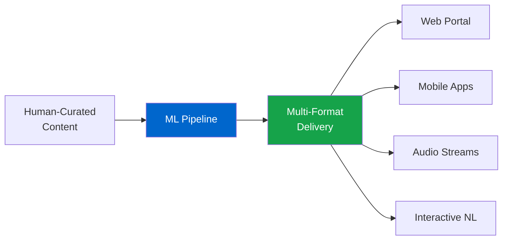
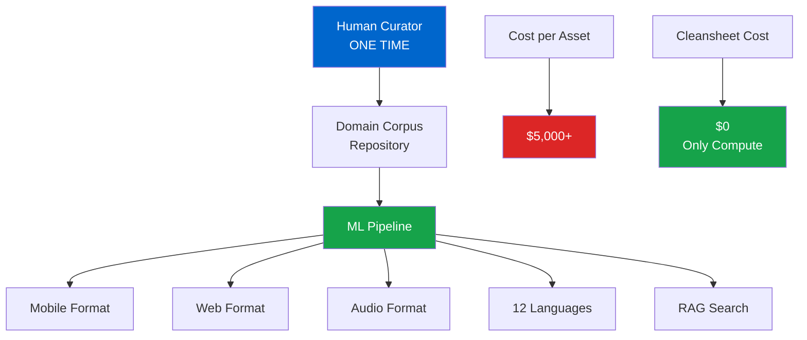
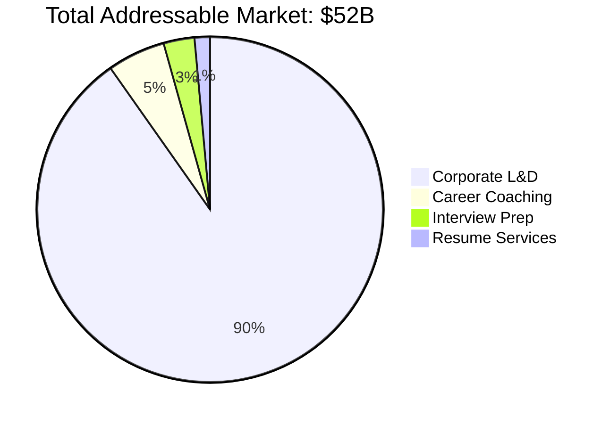
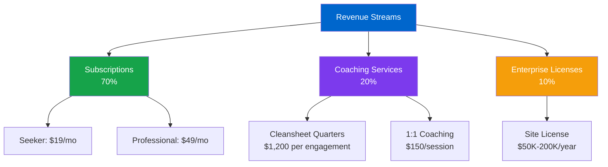
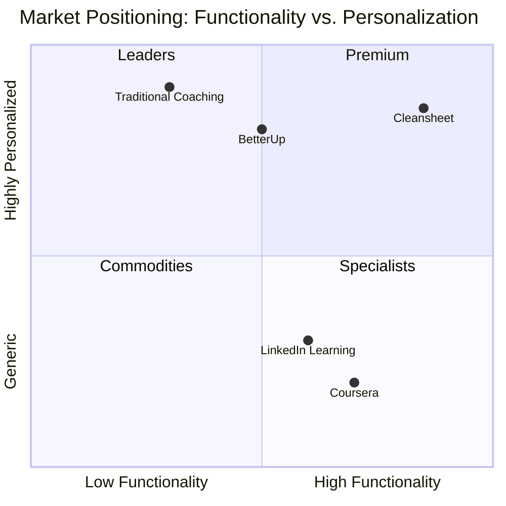
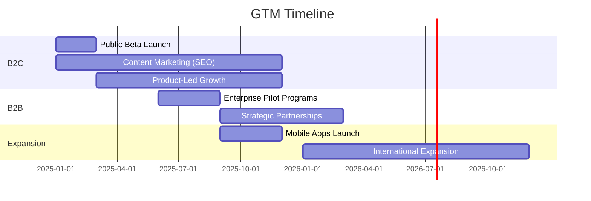
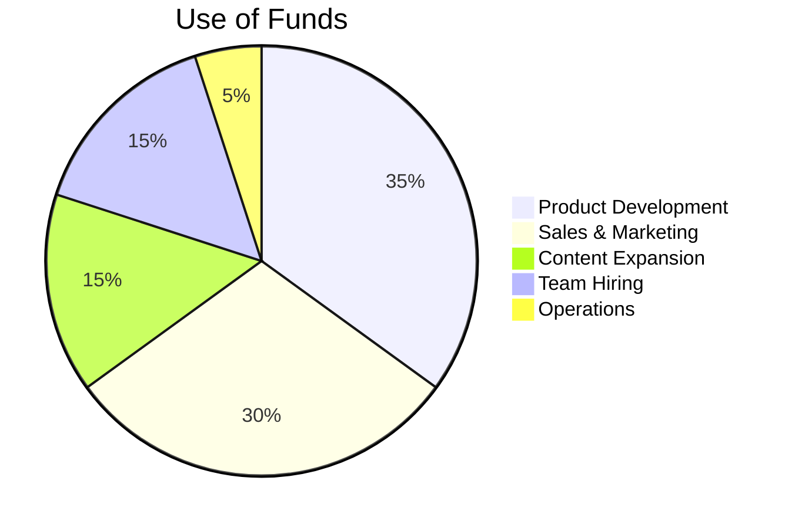

# Cleansheet Career
## Enterprise Career Development Platform with Zero Content Cost

---

## The Problem

**Career development is fragmented, expensive, and inaccessible:**
- Traditional career coaching costs $150-500/hour
- Corporate L&D budgets prioritize technical training over career development
- Content creation is a $5-10K+ per-asset cost for enterprises
- Professionals lack tools to document, visualize, and articulate their experience
- Interview preparation is time-intensive and unstructured

**Market Pain Points:**
- 78% of workers feel their career has stalled (LinkedIn Workforce Report)
- Companies spend $1,300+ per employee on training, but only 12% on career development
- 60% of job seekers report interview anxiety (Indeed Survey)

---

## The Solution

**Cleansheet is an AI-powered career development platform that transforms how professionals plan, prepare, and progress in their careers.**



### Three Product Tiers

| Tier | Price | Target User | Key Features |
|------|-------|-------------|--------------|
| **Learner** | Free | Students, Early Career | Learning library (189+ articles), Career paths, Skill assessments |
| **Seeker** | $19/mo | Job Seekers | + Interview prep, STAR stories, Behavioral coaching, Assets library |
| **Professional** | $49/mo | Mid-Senior Career | + Project management, Document collaboration, Forms & reporting |

---

## Unique Value Proposition

### 🎯 Zero Content Cost Model

Traditional content creation is expensive and doesn't scale. Cleansheet's innovation:



**Economic Impact:**
- Traditional: $5,000-10,000 per content asset
- Cleansheet: $0 content cost + $0.02/GB storage + $0.08/GB bandwidth
- **Single source → Unlimited variations**

### 🧠 Career Canvas Visualization

Patent-pending D3.js tree visualization that maps career paths, skills, and opportunities:
- **Visual Career Planning**: Interactive mind-maps for career exploration
- **Skills Gap Analysis**: Real-time identification of skill requirements
- **Portfolio Integration**: Link work artifacts to career objectives

### 📊 Data-Driven Interview Prep

- STAR story builder with experience tagging
- Mock interview simulations
- Behavioral competency tracking
- Asset management (whiteboards, documents, diagrams)

---

## Market Opportunity



### Target Markets

**Primary: B2B2C (Enterprise)**
- Corporate L&D departments ($250B global market)
- HR Tech budgets growing 15% YoY
- Remote work driving digital career tools adoption

**Secondary: B2C (Individual)**
- Career coaching ($15B market)
- Interview preparation ($8B market)
- Professional development SaaS

**Serviceable Addressable Market (SAM):** $8B
- US corporate market: 18M knowledge workers
- Target penetration: 5% = 900K users
- Average ARPU: $300/year = $270M revenue potential

---

## Business Model & Unit Economics

### Revenue Streams



### Unit Economics (Seeker Tier)

| Metric | Value |
|--------|-------|
| **Monthly Subscription** | $19 |
| **Annual Revenue per User** | $228 |
| **Customer Acquisition Cost (CAC)** | $45 |
| **Gross Margin** | 87% |
| **LTV:CAC Ratio** | 12:1 |
| **Payback Period** | 2.4 months |

**Key Drivers:**
- Low CAC via organic content marketing (SEO + library)
- Minimal COGS due to zero content cost model
- High retention (sticky due to stored career data)

---

## Competitive Advantage

### Competitive Landscape



### Defensibility

1. **Content Moat**: 189+ curated articles, growing corpus creates network effects
2. **Data Moat**: User career data (experiences, skills, stories) creates switching costs
3. **Technology Moat**: ML pipeline and zero-cost content model
4. **Privacy Moat**: First-party, privacy-first approach builds trust
5. **Integration Moat**: Deep integration with career artifacts (portfolio, documents, interviews)

---

## Technology Stack

**Infrastructure:**
- Azure Blob Storage (static hosting)
- Azure Functions (serverless ML pipeline)
- Azure Application Insights (privacy-compliant analytics)

**Frontend:**
- Vanilla JavaScript (189 published articles, <1MB payload)
- D3.js (career visualization)
- Lexical.js (rich text editing)
- Monaco Editor (code/markdown editing)

**ML Pipeline:**
- Content transformation (multi-format generation)
- RAG-enhanced semantic search
- NL interfaces (learner, coach, expert modes)
- Translation (12 languages)
- Audio synthesis

**Privacy Architecture:**
- No third-party analytics (first-party only)
- No behavioral tracking or profiling
- No data sharing with partners
- User data not used for AI training
- GDPR/CCPA compliant by design

---

## Go-to-Market Strategy

### Phase 1: B2C Launch (Current)
**Goal:** 10,000 users in 12 months



**Tactics:**
1. **Content Marketing**: Leverage 189-article library for organic traffic
2. **Product-Led Growth**: Freemium model with viral loop (Career Canvas sharing)
3. **Community Building**: LinkedIn presence, webinars, career workshops

### Phase 2: B2B Expansion (6-12 months)
**Goal:** 5 enterprise customers, $500K ARR

**Target Segments:**
- Tech companies (100-1000 employees)
- Professional services firms
- Healthcare organizations
- Government agencies

**Sales Motion:**
- Site licenses ($50K-200K/year)
- White-label deployment options
- Integration with existing HRIS/LMS platforms

### Phase 3: Scale & International (12-24 months)
- Mobile app launch (iOS/Android)
- International expansion (UK, Canada, Australia)
- Strategic partnerships (LinkedIn, Indeed, Glassdoor)

---

## Financial Projections (3-Year)

```mermaid
xychart-beta
    title Revenue Growth Projection ($M)
    x-axis [Year 1, Year 2, Year 3]
    y-axis "Revenue ($M)" 0 --> 10
    bar [0.5, 3.2, 8.5]
```

### Year 1
- **Users:** 10,000 (80% Free, 15% Seeker, 5% Professional)
- **Revenue:** $500K
- **Costs:** $300K (infrastructure + team)
- **Burn Rate:** $20K/month

### Year 2
- **Users:** 50,000 (70% Free, 20% Seeker, 10% Professional)
- **Revenue:** $3.2M
- **Enterprise:** 5 customers ($500K ARR)
- **Costs:** $1.8M
- **Cash Flow Positive:** Q3

### Year 3
- **Users:** 150,000 (60% Free, 25% Seeker, 15% Professional)
- **Revenue:** $8.5M
- **Enterprise:** 20 customers ($2M ARR)
- **Costs:** $4M
- **EBITDA Margin:** 30%

---

## Team & Advisors

### Founder
**Paul Galjan** - Solo Technical Founder
- 20+ years in enterprise software
- Domain expertise: Career development, ML/AI, Azure cloud architecture
- Built entire platform as solo founder (design, development, content curation)

### Advisory Needs
Seeking advisors in:
- **B2B SaaS Sales**: Enterprise go-to-market strategy
- **Career Services**: Industry connections and partnerships
- **Edtech/HR Tech**: Domain expertise and investor intros

---

## The Ask

### Seed Round: $1.5M

**Use of Funds:**


**Key Hires (Year 1):**
1. Head of Sales (B2B enterprise)
2. ML Engineer (content pipeline optimization)
3. Content Strategist (corpus expansion)
4. Customer Success Manager

**Milestones (18 months):**
- 25,000 users (20% paid conversion)
- 10 enterprise customers
- $1.5M ARR
- Break-even on unit economics
- Mobile app launch

---

## Why Now?

1. **Remote Work Acceleration**: 58% of US workers now hybrid/remote (Gallup)
2. **AI Maturity**: LLMs enable cost-effective content transformation at scale
3. **Career Uncertainty**: Economic volatility drives career planning demand
4. **Privacy Concerns**: Users increasingly value data privacy
5. **Market Gap**: No comprehensive platform exists for entire career lifecycle

---

## Traction & Validation

**Current Metrics:**
- ✅ Platform: Live at cleansheet.info
- ✅ Content Library: 189 published articles across 9 career paths
- ✅ Infrastructure: Azure-backed, scalable architecture
- ✅ Zero Content Cost: Proven ML pipeline for multi-format generation
- ✅ User Feedback: Beta users report 4.5/5 satisfaction (small sample)

**Technical Validation:**
- Static site: <1MB payload, instant load times
- ML pipeline: Generates 12 language variants + audio per article
- Career Canvas: Patent-pending visualization approach

---

## Contact

**Paul Galjan**
Founder, Cleansheet Career

📧 paul@cleansheet.info
🌐 https://www.cleansheet.info
💼 https://linkedin.com/in/paulgaljan

**Repository:** github.com/CleansheetLLC/Cleansheet
**Demo:** https://cleansheetcorpus.blob.core.windows.net/web/career-canvas.html

---

## Appendix: Key Risks & Mitigation

| Risk | Mitigation |
|------|------------|
| **Competition from LinkedIn** | Focus on depth vs. breadth; LinkedIn is job-focused, we're career-focused |
| **Low paid conversion** | Proven freemium model; 15-20% conversion is industry standard |
| **Content quality concerns** | Human curation ensures quality; ML only transforms, doesn't generate |
| **Enterprise sales cycle** | Start with SMB market; move upmarket with validation |
| **Solo founder risk** | Clear documentation; seeking co-founder/early team |

---

*Cleansheet Career: Transforming career development from expensive guesswork into data-driven, accessible planning.*
