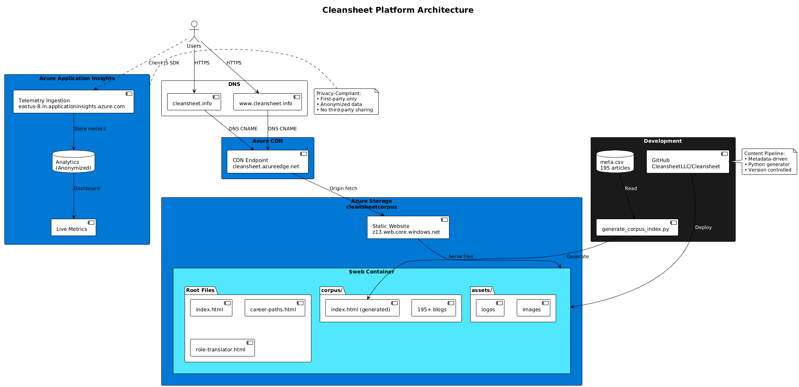

# Cleansheet Platform

> Technical Learning & Career Development Platform


---

## Overview

Cleansheet is an enterprise-grade content curation and career development platform designed to support technical professionals throughout their career journey. The platform combines curated learning content, interactive career tools, and coaching services to provide a comprehensive solution for skill development and career advancement in technology.

### Key Features

- **📚 Content Library** - 188+ curated technical articles with intelligent filtering by expertise level and topic tags
- **🗺️ Career Paths** - Interactive visualization of technical career progression from Citizen Developer to Cloud Operations and AI/ML Engineer
- **🧭 Role Translator** - Discover ideal tech roles by mapping skills and experience to career opportunities
- **🔄 ML Pipeline** - Automated content processing pipeline for multi-format deliverables
- **👥 Coaching & Mentorship** - 12-week Cleansheet Quarters with experienced technical coaches
- **🔒 Privacy-First** - Comprehensive privacy policies and data protection commitments

---

## Project Structure

```
Cleansheet/
├── index.html                    # Main landing page
├── learner.html                  # Modern learner interface ✨ NEW
├── job-seeker.html               # Job search app (pending)
├── professional.html             # Professional work app (pending)
├── career-paths.html             # Career progression navigator
├── experience-tagger-d3.html     # D3 network navigation demo
├── role-translator.html          # Role discovery tool
├── ml-pipeline.html              # Pipeline visualization
├── privacy-policy.html           # Privacy policy
├── privacy-principles.html       # Privacy commitments
├── terms-of-service.html         # Terms of service
│
├── shared/                       # Shared infrastructure ✨ NEW
│   ├── cleansheet-core.js        # Core utilities and design tokens
│   ├── data-service.js           # Data abstraction layer (localStorage/API)
│   ├── api-schema.js             # API contract definitions
│   └── library-data.js           # Auto-generated article data
│
├── corpus/                       # Content library (generated)
│   ├── index.html                # Traditional library browser
│   └── [article-slug].html       # Individual curated articles
│
├── assets/                       # Brand assets and logos
│   ├── high-resolution-logo-files/
│   ├── logos-for-business-tools/
│   ├── logos-for-mobile-apps/
│   ├── logos-for-social-media/
│   ├── printable-vector-files/
│   └── sample-logo/
│
├── meta/                         # Metadata and configuration
│   └── meta.csv                  # Article metadata (195 articles)
│
├── generate_corpus_index.py     # Unified generator (corpus + learner data)
├── seed-library-data.py          # Library data generator (called by above)
├── DESIGN_GUIDE.md              # Comprehensive design system documentation
├── CLAUDE.md                    # Project context and development guidelines
├── .gitignore                   # Git ignore patterns
└── README.md                    # This file
```

---

## Design System

### Corporate Professional Theme

**Colors:**
- Primary Blue: `#0066CC`
- Accent Blue: `#004C99`
- Dark: `#1a1a1a`
- Neutral Text: `#333333`
- Background: `#f5f5f7`

**Typography:**
- **Questrial** - Headings and UI elements
- **Barlow Light (300)** - Body text

**Iconography:**
- Phosphor Icons (MIT License)
- More professional and modern icon library with 6,000+ icons
- Consistent 60px × 60px icon containers

For complete design guidelines, see [`DESIGN_GUIDE.md`](doc/DESIGN_GUIDE.md).

---

## Getting Started

### Prerequisites

- Modern web browser (Chrome, Firefox, Safari, Edge)
- Python 3.8+ (for corpus generation)
- Basic understanding of HTML/CSS/JavaScript

### Local Development

1. **Clone the repository**
   ```bash
   git clone https://github.com/CleansheetLLC/Cleansheet.git
   cd Cleansheet
   ```

2. **Open in browser**
   ```bash
   # Simply open index.html in your browser
   open index.html  # macOS
   start index.html # Windows
   ```

3. **Generate corpus library** (if needed)
   ```bash
   python generate_corpus_index.py
   ```

### File Organization

- **HTML files** use `kebab-case.html` naming
- **Assets** use lowercase with dashes (no spaces)
- **CSS** uses CSS custom properties (`:root` variables)
- **All paths** are web-friendly without URL encoding

---

## Key Technologies

### Frontend
- **HTML5** - Semantic markup
- **CSS3** - Custom properties, Grid, Flexbox
- **Vanilla JavaScript** - No framework dependencies
- **D3.js v7** - Data visualization and network diagrams
- **Google Fonts** - Questrial & Barlow
- **Phosphor Icons** - Professional icon library (6,000+ icons, MIT License)

### Content Generation
- **Python 3** - Corpus index generation
- **CSV Processing** - Metadata management

### Design
- **Mobile-first** responsive design
- **WCAG 2.1 AA** accessibility compliance
- **Progressive enhancement** approach

---

## Platform Features

### 1. Modern Learner Interface (`learner.html`) ✨ NEW

**Production-ready learning platform with modern UX**

**Features:**
- **Tab Navigation**: Home and Library tabs with Phosphor icons
- **Search & Filter**: Debounced search across 189 articles
  - 5 expertise levels (Neophyte → Academic)
  - 14 topic tags (AI/ML, Architecture, Career, etc.)
  - 9 career paths (Citizen Developer, Cloud Computing, etc.)
- **Article Cards**: Smart summaries, reading time, level badges
- **Reading View**: Executive summary, detailed overview, full content
- **Bookmarks**: Save articles with toast notifications
- **Links to Corpus**: Deep-dive into full articles
- **Responsive**: Mobile-first design (single column ≤768px)
- **API-Ready**: Uses DataService abstraction layer

**Architecture:**
- Shared infrastructure (`cleansheet-core.js`, `data-service.js`, `library-data.js`)
- Auto-seeded from generated article data
- Switch to REST API: `new DataService('api')` (no code changes needed)

**Color Scheme:**
- Active tabs/states: #11304f (highlight color)
- User avatar: #11304f background

### 2. Traditional Content Library (`corpus/index.html`)

**Classic full-featured library browser**

**Features:**
- Search across titles, keywords, and content
- Expertise level filtering (Neophyte → Academic)
- Multi-select tag filtering (14 technical topics)
- 189 published articles + 6 drafts = 195 total
- Mobile-responsive with collapsible filters
- 60% slideout panel for article viewing

**Unified Generation Workflow:**
```bash
python generate_corpus_index.py
```

**What it does:**
1. Reads `meta/meta.csv` (195 articles)
2. Generates `corpus/index.html` (~1.1MB)
3. Generates `shared/library-data.js` (189 published articles)
4. Updates both traditional and modern interfaces

**Single command updates everything!**

### 2. Career Paths Tool

**Features:**
- Network diagram with clickable career nodes
- Technical career progression paths
- Path selector pills for different specializations
- Timeline visualization
- Mobile-optimized interface

### 2a. D3 Network Navigation Component

**Reference:** `experience-tagger-d3.html`

**Features:**
- Force-directed network visualization using D3.js v7
- Interactive career path relationships
- Three-tier node system (primary/secondary/tertiary)
- Compact 200px height for header navigation
- Rectangular nodes with rounded corners
- Fixed positioning with percentage-based coordinates
- Hover effects and active state highlighting
- Responsive layout with gentle force simulation
- Clean design: no borders on default state, highlight on selection

**Technical Details:**
- Uses D3.js v7 for rendering
- SVG-based visualization
- Percentage-based node positioning (0.0-1.0 range)
- Draggable nodes with fixed initial positions
- Primary nodes (100×30px blue rectangles)
- Tertiary nodes (100×26px gray rectangles, non-clickable)
- 1px link weight, 2px when active
- Drop-shadow glow on selected nodes

### 3. Role Translator

**Features:**
- Job role discovery and mapping
- Skills alignment to career opportunities
- Interactive role exploration
- Industry insights

### 4. ML Pipeline Tour

**Features:**
- Visual workflow diagram
- Content processing pipeline overview
- Multi-format delivery explanation

---

## Content Curation

### Zero Content Cost Model

- Human curation happens once in corpus repositories
- ML pipeline automates derivative format generation
- Single source → unlimited variations
- Per-delivery cost: $0 content, only compute/storage

### Content Flow

```
Corpus Repositories → ML Processing → Multi-Channel Delivery
```

**Capabilities:**
- Multi-device format generation (mobile, tablet, web)
- International language translation
- Audio synthesis and streaming
- RAG-enhanced semantic search
- Interactive NL interfaces

---

## Development Guidelines

### Design System Compliance

All new pages must:
1. Use CSS custom properties from `:root`
2. Follow Corporate Professional color palette
3. Use Questrial (headings) and Barlow Light (body)
4. Implement mobile-first responsive design
5. Include proper accessibility attributes
6. Reference correct asset paths (lowercase, dashes)

See [`DESIGN_GUIDE.md`](doc/DESIGN_GUIDE.md) for complete specifications.

### Code Standards

**HTML:**
- Semantic HTML5 elements
- Proper heading hierarchy (h1 → h2 → h3)
- Alt text on all images
- Viewport and charset meta tags

**CSS:**
- Use CSS variables for colors/fonts/spacing
- Mobile-first media queries (breakpoint: 768px)
- BEM-like naming conventions
- Box-sizing: border-box on all elements

**JavaScript:**
- Vanilla JS preferred (minimize dependencies)
- Event delegation for dynamic content
- LocalStorage for client-side state
- Error handling on network requests

### File Naming Conventions

- HTML: `kebab-case.html`
- CSS classes: `kebab-case`
- CSS variables: `--prefix-name`
- JavaScript: `camelCase`
- Assets: `lowercase-with-dashes.extension`

---

## Browser Support

- **Chrome/Edge**: Last 2 versions
- **Firefox**: Last 2 versions
- **Safari**: Last 2 versions (iOS and macOS)
- **Mobile**: iOS Safari 12+, Chrome Android 90+

---

## Deployment

### Static Hosting

The platform is designed for static hosting:
- No server-side processing required
- All content embedded in HTML
- CDN-ready for global distribution

### Recommended Hosts
- **Azure Static Web Apps**
- **Netlify**
- **Vercel**
- **GitHub Pages**
- **AWS S3 + CloudFront**

### Build Steps

1. Generate corpus library (if updated):
   ```bash
   python generate_corpus_index.py
   ```

2. Verify all assets are present:
   ```bash
   ls assets/high-resolution-logo-files/white-on-transparent.png
   ```

3. Test locally before deploying

4. Deploy static files to hosting platform

---

## Documentation

- **[DESIGN_GUIDE.md](doc/DESIGN_GUIDE.md)** - Comprehensive design system and style guide
- **[assets/README.md](assets/README.md)** - Asset usage and brand guidelines
- **[CLAUDE.md](CLAUDE.md)** - Project context and AI development guidelines
- **[.gitignore](.gitignore)** - Version control exclusions

---

## Roadmap

### Coming Soon

- ✨ **Learning Plans** - Personalized learning paths with progress tracking
- 📊 **Skills Assessment** - Evaluate and validate technical competencies
- 🎨 **Project Gallery** - Showcase capstone projects and portfolio work
- 🎥 **Live Collaboration** - Real-time coaching sessions with screen sharing
- 📈 **Market Analytics** - Location-sensitive career data and salary insights
- 💬 **Community Forums** - Connect with peers and share knowledge

### Future Enhancements

- Multi-language support (content translation)
- Audio streaming for articles
- Mobile apps (iOS/Android)
- API access for enterprise integrations
- Custom ML model training services
- White-label platform deployment

---

## Contributing

Contributions are welcome! This repository is open to community contributions while maintaining proprietary licensing.

**Before contributing:**
- Review our [Code of Conduct](doc/CODE_OF_CONDUCT.md)
- Read the [Contributing Guidelines](CONTRIBUTING.md)
- Check existing issues and pull requests
- Review `DESIGN_GUIDE.md` for technical standards

**How to contribute:**
1. Fork the repository
2. Create a feature branch (`git checkout -b feature/amazing-feature`)
3. Follow code standards in `DESIGN_GUIDE.md`
4. Commit changes (`git commit -m 'Add amazing feature'`)
5. Push to your branch (`git push origin feature/amazing-feature`)
6. Open a Pull Request

**Repository**: `CleansheetLLC/Cleansheet`
**Documentation**: See `DESIGN_GUIDE.md` and `CLAUDE.md`

### Development Workflow

1. Review `DESIGN_GUIDE.md` for design standards
2. Follow code standards and naming conventions
3. Test across supported browsers
4. Verify mobile responsiveness
5. Check accessibility compliance (WCAG 2.1 AA)
6. Update documentation as needed

---

## Technical Architecture



### Infrastructure Overview

**Azure-based deployment** featuring:
- **Azure CDN** - Global content delivery with HTTPS/SSL termination
- **Azure Storage** - Static website hosting from `$web` container
- **Azure Application Insights** - Privacy-compliant analytics and telemetry

### Content Pipeline
```
Corpus repositories → ML processing → Multi-channel delivery
```

**Delivery Channels:**
- Mobile apps (iOS/Android)
- Web portal (cleansheet.info)
- Audio streaming
- Multi-language variants

**Key Capabilities:**
- Multi-device format generation
- International language translation
- Audio synthesis and streaming
- RAG-enhanced semantic search
- Interactive NL interfaces (learner, coach, expert)

---

## Privacy & Security

- **Privacy-first design** - No data sales
- **Comprehensive policies** - Privacy Policy, Privacy Principles, Terms of Service
- **Secure authentication** - LinkedIn OAuth integration
- **Data protection** - GDPR and CCPA compliant
- **Malicious content scanning** - All uploads automatically scanned
- **AI monitoring** - Tone, emotion, and content analysis on interactions

For details, see:
- [Privacy Policy](privacy-policy.html)
- [Privacy Principles](privacy-principles.html)
- [Terms of Service](terms-of-service.html)

---

## License

**Proprietary License** - All rights reserved.

This is proprietary software. Unauthorized copying, distribution, modification, or use of this software, via any medium, is strictly prohibited without explicit written permission from Cleansheet LLC.

For licensing inquiries, contact: [cleansheet.info](https://www.cleansheet.info)

© 2025 Cleansheet LLC. All rights reserved.

---

## Support

For questions, issues, or feature requests:

- **Website**: [cleansheet.info](https://www.cleansheet.info)
- **Repository**: [github.com/CleansheetLLC/Cleansheet](https://github.com/CleansheetLLC/Cleansheet)
- **Documentation**: `DESIGN_GUIDE.md`, `CLAUDE.md`
- **Security Issues**: security@cleansheet.dev

---

## Version History

- **v1.0** (2025-10) - Initial platform launch
  - Main landing page with 6 feature cards
  - Content library with 188 curated articles
  - Career paths interactive tool
  - Role translator
  - ML pipeline visualization
  - Privacy and legal pages
  - Comprehensive design system
  - Mobile-responsive design

---

## Acknowledgments

- **Security and Compliance** - [2x4 www.dugganusa.com](https://2x4.dugganusa.com/)
- **D3.js** - Data visualization library (BSD 3-Clause License)
- **Phosphor Icons** - Icon library (6,000+ icons, MIT License)
- **Google Fonts** - Questrial and Barlow typefaces
- **Azure** - Cloud infrastructure and ML services

---

**Built for technical professionals everywhere.**
