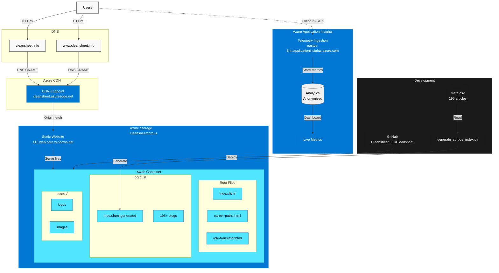

# Cleansheet Platform Architecture

```mermaid
flowchart TB
    %% Define styles
    classDef azure fill:#0078D4,stroke:#0078D4,color:#fff
    classDef azureLight fill:#50E6FF,stroke:#0078D4,color:#000
    classDef development fill:#1a1a1a,stroke:#1a1a1a,color:#fff
    classDef user fill:#f9f9f9,stroke:#333,color:#000
    classDef dns fill:#f9f9f9,stroke:#333,color:#000
    classDef database fill:#f0f0f0,stroke:#666,color:#000

    %% Users
    Users[Users]:::user

    %% DNS Layer
    subgraph DNS ["DNS"]
        DNS1[cleansheet.info]:::dns
        DNS2[www.cleansheet.info]:::dns
    end

    %% Azure CDN
    subgraph AzureCDN ["Azure CDN"]
        CDN[CDN Endpoint<br/>cleansheet.azureedge.net]:::azure
    end

    %% Azure Storage
    subgraph AzureStorage ["Azure Storage<br/>cleansheetcorpus"]
        subgraph WebContainer ["$web Container"]
            subgraph RootFiles ["Root Files"]
                IndexHTML[index.html]:::azureLight
                CareerPaths[career-paths.html]:::azureLight
                RoleTranslator[role-translator.html]:::azureLight
            end
            subgraph Corpus ["corpus/"]
                CorpusIndex["index.html generated"]:::azureLight
                Blogs["195+ blogs"]:::azureLight
            end
            subgraph Assets ["assets/"]
                Logos[logos]:::azureLight
                Images[images]:::azureLight
            end
        end
        StaticWeb[Static Website<br/>z13.web.core.windows.net]:::azure
    end

    %% Application Insights
    subgraph AppInsights ["Azure Application Insights"]
        Telemetry[Telemetry Ingestion<br/>eastus-8.in.applicationinsights.azure.com]:::azure
        Analytics[("Analytics<br/>Anonymized")]:::database
        LiveMetrics[Live Metrics]:::azure
    end

    %% Development
    subgraph Development ["Development"]
        GitHub[GitHub<br/>CleansheetLLC/Cleansheet]:::development
        Generator[generate_corpus_index.py]:::development
        Metadata[("meta.csv<br/>195 articles")]:::development
    end

    %% Main flow connections
    Users -->|HTTPS| DNS1
    Users -->|HTTPS| DNS2
    DNS1 -->|DNS CNAME| CDN
    DNS2 -->|DNS CNAME| CDN
    CDN -->|Origin fetch| StaticWeb
    StaticWeb -->|Serve files| WebContainer

    %% Telemetry connections
    Users -.->|Client JS SDK| Telemetry
    Telemetry -->|Store metrics| Analytics
    Analytics -->|Dashboard| LiveMetrics

    %% Development pipeline
    Metadata -->|Read| Generator
    Generator -->|Generate| CorpusIndex
    GitHub -->|Deploy| WebContainer

    %% Apply styles
    class AzureStorage,AppInsights azure
    class WebContainer azureLight
    class Development development
```
