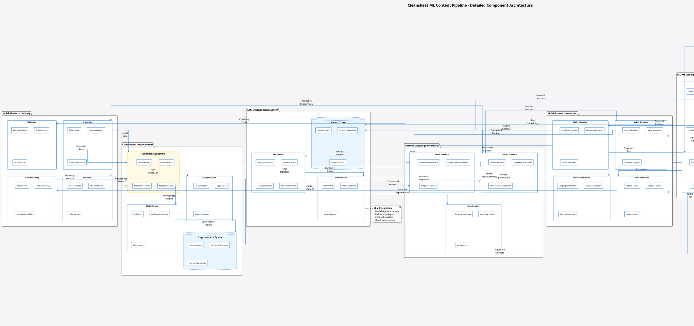

```plantuml
@startuml 
!theme plain
skinparam linetype ortho
skinparam backgroundColor #F5F5F7
skinparam componentStyle rectangle

' Color scheme
!define PRIMARY #0066CC
!define ACCENT #004C99
!define LIGHT #E8F5FF
!define DARK #1A1A1A

skinparam component {
  BackgroundColor white
  BorderColor PRIMARY
  ArrowColor PRIMARY
  FontSize 10
}

skinparam database {
  BackgroundColor LIGHT
  BorderColor PRIMARY
}

skinparam queue {
  BackgroundColor #FFF9E6
  BorderColor #FFD700
}

title Cleansheet ML Content Pipeline - Detailed Component Architecture
' External Input
database "CMS\nReviewed Content" as CMS {
  component [HTML Content] as HTML
  component [Metadata] as META
  component [Classification Tags] as TAGS
  component [4-Level Summaries] as SUMM
}

package "Reviewed Corpus" {
  database "Content Repository" as REPO1 {
    component [503+ Educational Modules] as MODULES
    component [157+ JSON Datasets] as DATASETS
    component [Topics & Taxonomy] as TAXONOMY
    component [Difficulty Ratings] as DIFFICULTY
  }
}

package "ML Processing Engine" {
  component "Content Analyzer" as ANALYZER {
    [Semantic Analysis] as SEM
    [Concept Extraction] as CONCEPT
    [Key Relationships] as RELATIONSHIPS
  }
  
  component "Format Adapter" as ADAPTER {
    [Screen Size Detection] as SCREEN
    [Layout Optimizer] as LAYOUT
    [Progressive Disclosure] as PROGRESSIVE
  }
  
  component "Language Processor" as NLP {
    [Summarization Engine] as SUMMARIZE
    [Q&A Generator] as QA
    [Difficulty Analyzer] as DIFF_ANALYZE
  }
  
  component "Audio Generator" as AUDIO {
    [Text-to-Speech] as TTS
    [Natural Pacing] as PACING
    [Emphasis Detection] as EMPHASIS
  }
}


' Stage 3: Dynamic Generation
package "Multi-Format Generation" {
  component "Mobile Generator" as MOBILE {
    [Touch-Friendly UI] as TOUCH
    [Swipe Navigation] as SWIPE
    [Condensed Layouts] as CONDENSED
  }
  
  component "Tablet Generator" as TABLET {
    [Rich Media Layouts] as RICH_MEDIA
    [Interactive Elements] as INTERACTIVE
    [Split-Screen Views] as SPLIT
  }
  
  component "Internationalization" as I18N {
    [Language Translation] as TRANSLATE
    [Cultural Adaptation] as CULTURE
    [Technical Accuracy] as ACCURACY
  }
  
  component "Audio Production" as AUDIO_PROD {
    [Podcast Format] as PODCAST
    [Chapter Markers] as CHAPTERS
    [Speed Controls] as SPEED
  }
}

' Stage 4: Interactive Systems
package "Natural Language Interfaces" {
  component "Learner Interface" as LEARNER_NL {
    [Conversational AI] as CONV_AI
    [Knowledge Adaptation] as ADAPT
    [Personalized Explanations] as PERSONAL_EXP
  }
  
  component "Coach Interface" as COACH_NL {
    [Skill Development Guide] as SKILL_GUIDE
    [Project Recommendations] as PROJECT_REC
    [Progress Tracking] as PROGRESS
  }
  
  component "Expert System" as EXPERT {
    [Technical Deep-Dive] as DEEP_DIVE
    [Edge Case Analysis] as EDGE_CASES
    [Best Practices] as BEST_PRACTICE
  }
}


' Stage 5: RAG Integration
package "RAG Enhancement System" {
  database "Vector Store" as VECTOR_DB {
    [Content Embeddings] as EMBEDDINGS
    [Semantic Index] as SEM_INDEX
    [Similarity Scores] as SIMILARITY
  }
  
  component "RAG Pipeline" as RAG {
    [Query Vectorization] as Q_VECTOR
    [Similarity Search] as SIM_SEARCH
    [Context Assembly] as CONTEXT
    [LLM Enhancement] as LLM_ENHANCE
  }
  
  component "LLM Interface" as LLM_INT {
    [OpenAI API] as OPENAI
    [Anthropic Claude] as CLAUDE
    [Model Selection] as MODEL_SELECT
  }
}
' Stage 6: Delivery
package "Multi-Platform Delivery" {
  component "Mobile App" as MOBILE_APP {
    [Offline Mode] as OFFLINE
    [Push Notifications] as PUSH
    [Native Performance] as NATIVE
  }
  
  component "Tablet App" as TABLET_APP {
    [Rich Interactions] as RICH_INT
    [Stylus Support] as STYLUS
    [Multi-Window] as MULTI_WIN
  }
  
  component "Web Portal" as WEB {
    [Full Feature Set] as FULL_FEAT
    [Real-Time Collab] as COLLAB
    [Atlas Canvas] as CANVAS
  }
  
  component "Audio Streaming" as AUDIO_STREAM {
    [Podcast Feed] as FEED
    [Background Play] as BACKGROUND
    [Download for Offline] as DOWNLOAD
  }
}

' Stage 7: Feedback Loop
package "Continuous Improvement" {
  queue "Feedback Collection" as FEEDBACK_Q {
    [Quality Ratings] as RATINGS
    [Usage Patterns] as PATTERNS
    [Completion Metrics] as COMPLETION
    [Engagement Data] as ENGAGEMENT
  }
  
  component "Analytics Engine" as ANALYTICS {
    [Anonymization] as ANON
    [Aggregation] as AGG
    [Pattern Detection] as PATTERN_DETECT
  }
  
  component "Model Tuning" as TUNING {
    [A/B Testing] as AB_TEST
    [Performance Metrics] as PERF_METRICS
    [Optimization] as OPTIMIZE
  }
  
  database "Improvement Queue" as IMPROVE_Q {
    [Model Updates] as MODEL_UPDATE
    [Content Refinements] as CONTENT_REF
    [Format Adjustments] as FORMAT_ADJ
  }
}

' Main Data Flows

' Input to Reviewed Corpus
CMS --> REPO1 : Published\nContent

' Corpus to ML Processing
REPO1 --> ANALYZER : Content +\nMetadata
REPO1 --> NLP : Raw Text
REPO1 --> ADAPTER : Structure
REPO1 --> AUDIO : Content

' ML Processing to Generation
ANALYZER --> MOBILE : Analyzed\nContent
ANALYZER --> TABLET : Analyzed\nContent
NLP --> I18N : Processed\nText
NLP --> AUDIO_PROD : Summaries
AUDIO --> AUDIO_PROD : Audio\nFiles

' Generation to Interactive Systems
MOBILE --> LEARNER_NL : Mobile\nContent
TABLET --> LEARNER_NL : Tablet\nContent
MOBILE --> COACH_NL : Formatted\nContent
TABLET --> COACH_NL : Formatted\nContent

' Generation to RAG
ANALYZER --> VECTOR_DB : Semantic\nVectors
NLP --> VECTOR_DB : Text\nEmbeddings

' RAG Flow
VECTOR_DB --> RAG : Indexed\nContent
RAG --> LLM_INT : Context +\nQuery
LLM_INT --> LEARNER_NL : Enhanced\nResponses
LLM_INT --> COACH_NL : Contextual\nAnswers
LLM_INT --> EXPERT : Detailed\nExplanations

' Interactive to Delivery
LEARNER_NL --> MOBILE_APP : Interactive\nExperiences
LEARNER_NL --> WEB : Chat\nInterface
COACH_NL --> TABLET_APP : Coaching\nTools
AUDIO_PROD --> AUDIO_STREAM : Audio\nContent

' Delivery to Feedback
MOBILE_APP --> FEEDBACK_Q : Usage\nData
TABLET_APP --> FEEDBACK_Q : Interaction\nData
WEB --> FEEDBACK_Q : Engagement\nMetrics
AUDIO_STREAM --> FEEDBACK_Q : Listening\nPatterns

' Feedback Loop Processing
FEEDBACK_Q --> ANALYTICS : Raw\nFeedback
ANALYTICS --> TUNING : Anonymized\nInsights
TUNING --> IMPROVE_Q : Optimization\nSignals

' Feedback back to ML Processing
IMPROVE_Q --> ANALYZER : Model\nImprovements
IMPROVE_Q --> NLP : Algorithm\nUpdates
IMPROVE_Q --> ADAPTER : Format\nOptimization

' Key Notes
note right of VECTOR_DB
  <b>Vector Store Technology:</b>
  • High-dimensional embeddings
  • Semantic similarity search
  • Sub-second query response
  • Scales to 500+ modules
end note

note left of ANALYTICS
  <b>Privacy-First Analytics:</b>
  ✓ All data anonymized
  ✓ No individual tracking
  ✓ Aggregate patterns only
  ✓ GDPR/CCPA compliant
  ✓ Transparent processing
end note

note bottom of LLM_INT
  <b>LLM Integration:</b>
  • Model-agnostic design
  • Fallback strategies
  • Cost optimization
  • Quality monitoring
end note

note top of REPO1
  <b>Content Library Scale:</b>
  • 503+ HTML modules
  • 157+ JSON datasets
  • 908KB of widgets
  • Continuously growing
end note

legend right
  <b>Pipeline Transformation:</b>
  
  <b>Static → Dynamic</b>
  One-size-fits-all → Personalized
  Single format → Multi-modal
  Read-only → Interactive
  Manual → AI-powered
  
  <b>Key Benefits:</b>
  • Zero marginal content cost
  • Instant personalization
  • Platform-wide learning
  • Continuous improvement
  • Privacy-preserved analytics
endlegend

@enduml
```