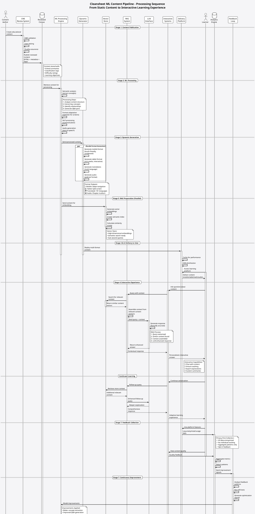

```plantuml
@startuml ML Pipeline - Sequence Flow
!theme plain
skinparam backgroundColor #F5F5F7
skinparam sequenceArrowThickness 2
skinparam roundcorner 10
skinparam maxMessageSize 150

title Cleansheet ML Content Pipeline - Processing Sequence\nFrom Static Content to Interactive Learning Experience

actor "Content\nAuthor" as Author
participant "CMS\nReview System" as CMS
database "Reviewed\nCorpus" as Corpus
participant "ML Processing\nEngine" as ML
participant "Dynamic\nGenerator" as Generator
participant "Vector\nStore" as Vector
participant "RAG\nSystem" as RAG
participant "LLM\nInterface" as LLM
participant "Interactive\nSystems" as Interactive
participant "Delivery\nPlatform" as Delivery
actor "Learner" as Learner
database "Analytics\nEngine" as Analytics
participant "Feedback\nLoop" as Feedback

== Stage 1: Content Publication ==

Author -> CMS : Create educational content
activate CMS
CMS -> CMS : SME validation
CMS -> CMS : User testing
CMS -> CMS : Quality assurance
CMS -> Corpus : Publish reviewed content\n(HTML + metadata + tags)
deactivate CMS

activate Corpus
note right of Corpus
  Content stored with:
  • 4-level summaries
  • Classification tags
  • Difficulty ratings
  • Learning objectives
end note

== Stage 2: ML Processing ==

Corpus -> ML : Retrieve content for processing
activate ML

ML -> ML : Semantic analysis\n(extract concepts)
note right of ML
  Processing Steps:
  1. Analyze content structure
  2. Extract key concepts
  3. Identify relationships
  4. Generate Q&A pairs
end note

ML -> ML : Format adaptation\n(optimize for screens)
ML -> ML : NLP processing\n(summarization)
ML -> ML : Audio generation\n(text-to-speech)

== Stage 3: Dynamic Generation ==

ML -> Generator : Send processed content
activate Generator

par Parallel Format Generation
  Generator -> Generator : Generate mobile format\n(touch-friendly, condensed)
  Generator -> Generator : Generate tablet format\n(rich media, interactive)
  Generator -> Generator : Generate translations\n(multi-language)
  Generator -> Generator : Generate audio\n(podcast format)
end

note right of Generator
  Format Outputs:
  📱 Mobile: Swipe navigation
  💻 Tablet: Split-screen
  🌍 Translated: 10+ languages
  🎧 Audio: Chapter markers
end note

== Stage 5: RAG Preparation (Parallel) ==

ML -> Vector : Send content for embedding
activate Vector
Vector -> Vector : Generate vector embeddings
Vector -> Vector : Create semantic index
Vector -> Vector : Calculate similarity scores
note right of Vector
  Vector Store:
  • High-dimensional embeddings
  • Semantic search ready
  • Sub-second queries
end note
deactivate Vector

== Stage 4 & 6: Delivery to User ==

Generator -> Delivery : Deploy multi-format content
activate Delivery
deactivate Generator
deactivate ML

Delivery -> Delivery : Cache for performance
Delivery -> Delivery : CDN distribution

Learner -> Delivery : Access learning platform
activate Learner
Delivery --> Learner : Deliver content\n(mobile/tablet/web/audio)

== Stage 4: Interactive Experience ==

Learner -> Interactive : Ask question about content
activate Interactive

Interactive -> RAG : Query with context
activate RAG

RAG -> Vector : Search for relevant content
activate Vector
Vector --> RAG : Return similar content vectors
deactivate Vector

RAG -> RAG : Assemble context from\nrelevant content sections

RAG -> LLM : Send query + context
activate LLM

LLM -> LLM : Generate response\n(factually accurate)
note right of LLM
  RAG Process:
  1. Query vectorized
  2. Similar content found
  3. Context assembled
  4. LLM enhanced response
end note

LLM --> RAG : Return enhanced answer
deactivate LLM

RAG --> Interactive : Contextual response
deactivate RAG

Interactive --> Learner : Personalized, interactive answer
note left of Learner
  Interactive Capabilities:
  💬 Chat with content
  🎯 Virtual coaching
  🧠 Expert explanations
  📝 Custom summaries
end note

== Continued Learning ==

Learner -> Interactive : Continue conversation
Interactive -> RAG : Follow-up query
RAG -> Vector : Retrieve more context
Vector --> RAG : Additional relevant content
RAG -> LLM : Enhanced follow-up query
LLM --> RAG : Deeper explanation
RAG --> Interactive : Comprehensive response
Interactive --> Learner : Adaptive learning experience

== Stage 7: Feedback Collection ==

Learner -> Delivery : Use platform features
Delivery -> Analytics : Log anonymized usage data
activate Analytics

note right of Analytics
  Privacy-First Collection:
  ✓ All data anonymized
  ✓ No individual tracking
  ✓ Aggregate patterns only
  ✓ Opt-in feedback
end note

Learner -> Interactive : Rate content quality
Interactive -> Analytics : Quality feedback
deactivate Learner

Analytics -> Analytics : Aggregate metrics
Analytics -> Analytics : Detect patterns
Analytics -> Feedback : Send improvement signals
activate Feedback

== Stage 7: Continuous Improvement ==

Feedback -> Feedback : Analyze feedback patterns
Feedback -> Feedback : Run A/B tests
Feedback -> Feedback : Generate optimization signals

Feedback -> ML : Model improvements
note right of ML
  Improvements Applied:
  • Better concept extraction
  • Improved Q&A generation
  • Enhanced format adaptation
  • Optimized audio pacing
end note

Feedback -> Generator : Format optimizations
Feedback -> RAG : Context tuning

note over Corpus, Feedback
  <b>Feedback Loop Closes:</b>
  Next content batch processes with improved models
end note

deactivate Feedback
deactivate Analytics
deactivate Interactive
deactivate Delivery
deactivate Corpus

== Summary ==

note over Author, Feedback
  <b>Complete Pipeline Transformation:</b>
  
  <b>Input:</b> Static blog post (HTML)
  <b>Output:</b> Dynamic, multi-modal, interactive learning experience
  
  <b>Key Capabilities Enabled:</b>
  • Personalized explanations (adapts to learner level)
  • Multi-format delivery (mobile, tablet, web, audio)
  • Conversational learning (ask questions, get answers)
  • Continuous improvement (learns from usage)
  • Privacy-preserved analytics (no individual tracking)
  
  <b>Result:</b> Zero marginal cost content scaling with AI-powered personalization
end note

@enduml
```