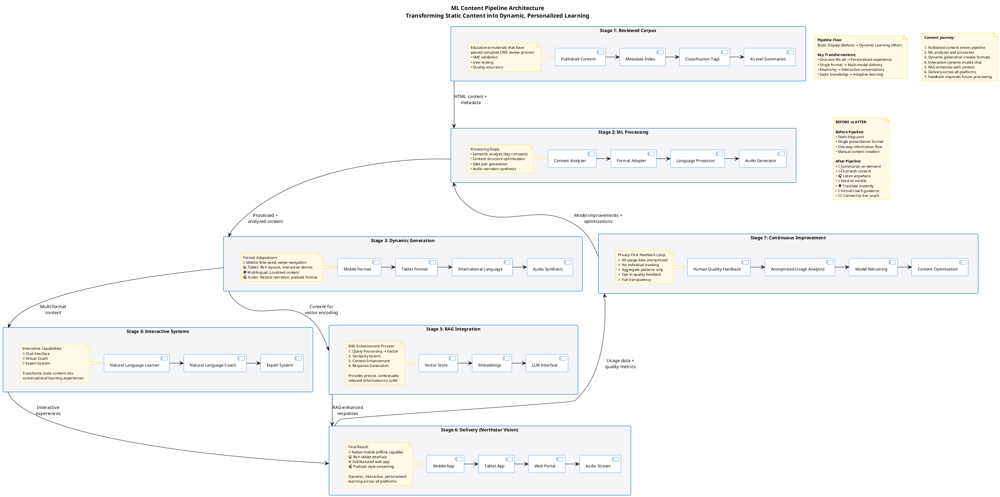

```plantuml
@startuml ML Content Pipeline - Cleansheet
!define DARKBLUE #0066CC
!define ACCENTBLUE #004C99
!define LIGHTGRAY #F5F5F7
!define DARKGRAY #1A1A1A

skinparam backgroundColor white
skinparam defaultFontName Arial
skinparam defaultFontSize 11

skinparam packageStyle rectangle
skinparam package {
  BorderColor DARKBLUE
  BackgroundColor LIGHTGRAY
  FontSize 12
  FontStyle bold
}

skinparam component {
  BackgroundColor white
  BorderColor DARKBLUE
  FontSize 10
}

skinparam note {
  BackgroundColor #FFF9E6
  BorderColor #FFD700
  FontSize 9
}

title ML Content Pipeline Architecture\nTransforming Static Content into Dynamic, Personalized Learning

' Stage 1: Reviewed Corpus
package "Stage 1: Reviewed Corpus" as Stage1  {
  component "Published Content" as PC1
  component "Metadata Index" as MI1
  component "Classification Tags" as CT1
  component "4-Level Summaries" as SUM1
  
  note left of PC1
    Educational materials that have 
    passed complete CMS review process:
    • SME validation
    • User testing  
    • Quality assurance
  end note
  
  PC1 -right-> MI1
  MI1 -right-> CT1
  CT1 -right-> SUM1
}

' Stage 2: ML Processing
package "Stage 2: ML Processing" as Stage2  {
  component "Content Analyzer" as CA2
  component "Format Adapter" as FA2
  component "Language Processor" as LP2
  component "Audio Generator" as AG2
  
  note left of CA2
    Processing Steps:
    • Semantic analysis (key concepts)
    • Content structure optimization
    • Q&A pair generation
    • Audio narration synthesis
  end note
  
  CA2 -right-> FA2
  FA2 -right-> LP2
  LP2 -right-> AG2
}

' Stage 3: Dynamic Generation
package "Stage 3: Dynamic Generation" as Stage3  {
  component "Mobile Format" as MF3
  component "Tablet Format" as TF3
  component "International Language" as IL3
  component "Audio Synthesis" as AS3
  
  note left of MF3
    Format Adaptations:
    📱 Mobile: Bite-sized, swipe navigation
    💻 Tablet: Rich layouts, interactive demos
    🌍 Multilingual: Localized content
    🎧 Audio: Natural narration, podcast format
  end note
  
  MF3 -right-> TF3
  TF3 -right-> IL3
  IL3 -right-> AS3
}

' Stage 4: Interactive Systems
package "Stage 4: Interactive Systems" as Stage4  {
  component "Natural Language Learner" as NLL4
  component "Natural Language Coach" as NLC4
  component "Expert System" as ES4
  
  note left of NLL4
    Interactive Capabilities:
    💬 Chat Interface
    🎯 Virtual Coach
    🧠 Expert System
    
    Transforms static content into
    conversational learning experiences
  end note
  
  NLL4 -right-> NLC4
  NLC4 -right-> ES4
}

' Stage 5: RAG Integration
package "Stage 5: RAG Integration" as Stage5  {
  component "Vector Store" as VS5
  component "Embeddings" as EMB5
  component "LLM Interface" as LLM5
  
  note left of VS5
    RAG Enhancement Process:
    1. Query Processing → Vector
    2. Similarity Search
    3. Context Enhancement
    4. Response Generation
    
    Provides precise, contextually
    relevant information to LLMs
  end note
  
  VS5 -right-> EMB5
  EMB5 -right-> LLM5
}

' Stage 6: Delivery
package "Stage 6: Delivery (Northstar Vision)" as Stage6  {
  component "Mobile App" as MA6
  component "Tablet App" as TA6
  component "Web Portal" as WP6
  component "Audio Stream" as AUS6
  
  note left of MA6
    Final Result:
    📱 Native mobile (offline capable)
    💻 Rich tablet interface
    🌐 Full-featured web app
    🎧 Podcast-style streaming
    
    Dynamic, interactive, personalized
    learning across all platforms
  end note
  
  MA6 -right-> TA6
  TA6 -right-> WP6
  WP6 -right-> AUS6
}

' Stage 7: Continuous Improvement (Feedback Loop)
package "Stage 7: Continuous Improvement" as Stage7  {
  component "Human Quality Feedback" as HQF7
  component "Anonymized Usage Analytics" as AUA7
  component "Model Retraining" as MR7
  component "Content Optimization" as CO7
  
  note left of HQF7
    Privacy-First Feedback Loop:
    ✓ All usage data anonymized
    ✓ No individual tracking
    ✓ Aggregate patterns only
    ✓ Opt-in quality feedback
    ✓ Full transparency
  end note
  
  HQF7 -right-> AUA7
  AUA7 -right-> MR7
  MR7 -right-> CO7
}

' Main Pipeline Flow
Stage1 -down-> Stage2 : HTML content +\nmetadata
Stage2 -down-> Stage3 : Processed +\nanalyzed content
Stage3 -down-> Stage4 : Multi-format\ncontent
Stage3 -down-> Stage5 : Content for\nvector encoding
Stage4 -down-> Stage6 : Interactive\nexperiences
Stage5 -down-> Stage6 : RAG-enhanced\nresponses

' Feedback Loop (curved back to ML Processing)
Stage6 -up-> Stage7 : Usage data +\nquality metrics
Stage7 -up-> Stage2 : Model improvements +\noptimizations

' Alternative representation of connections between stages
note as N1
  <b>Pipeline Flow:</b>
  Static Display (Before) → Dynamic Learning (After)
  
  <b>Key Transformations:</b>
  • One-size-fits-all → Personalized experience
  • Single format → Multi-modal delivery
  • Read-only → Interactive conversations
  • Static knowledge → Adaptive learning
end note

' Detailed Process Flows

note as ProcessFlow
  <b>Content Journey:</b>
  
  1. Published content enters pipeline
  2. ML analyzes and processes
  3. Dynamic generation creates formats
  4. Interactive systems enable chat
  5. RAG enhances with context
  6. Delivery across all platforms
  7. Feedback improves future processing
end note

' Comparison callout
note as Comparison
  <b>BEFORE vs AFTER:</b>
  
  <b>Before Pipeline:</b>
  • Static blog post
  • Single presentation format
  • One-way information flow
  • Manual content creation
  
  <b>After Pipeline:</b>
  • 📄 Summarize on demand
  • 💬 Chat with content
  • 🎧 Listen anywhere
  • 📱 Send to mobile
  • 🌍 Translate instantly
  • 🤖 Virtual coach guidance
  • 👨‍🏫 Connect to live coach
end note

@enduml
```