# Figures and Drawings Description

## BRIEF DESCRIPTION OF THE DRAWINGS

The following figures illustrate various embodiments and aspects of the interactive career portfolio visualization system. These drawings are provided for illustrative purposes and should not be considered limiting to the scope of the invention.

## FIGURE 1: System Architecture Overview

**Figure 1** is a block diagram showing the overall system architecture of the interactive career portfolio visualization system, including:

- **Data Storage Layer (101)**: Database containing career experiences, narrative stories, and portfolio items with bidirectional relationships
- **Processing Engine (102)**: Core logic for generating hierarchical tree structures and managing node relationships
- **D3.js Visualization Engine (103)**: Rendering component implementing fixed-node tree layout algorithms
- **User Interface Controller (104)**: Module managing user interactions and progressive disclosure
- **Integration Layer (105)**: APIs for importing/exporting career data from external sources
- **Memory Management System (106)**: Component handling lazy loading and node caching for performance optimization

## FIGURE 2: Bidirectional Career Knowledge Graph Data Structure

**Figure 2** is a schematic diagram illustrating the bidirectional relationship structure between career data elements:

- **Career Experience Nodes (201)**: Rectangular nodes representing professional roles with competency tags
- **Narrative Story Nodes (202)**: Oval nodes representing achievement stories with competency reinforcement
- **Portfolio Item Nodes (203)**: Diamond nodes representing tangible artifacts with competency evidence
- **Bidirectional Links (204)**: Arrows showing forward and reverse navigation paths
- **Competency Tags (205)**: Labeled connections indicating shared competencies across nodes
- **Proof Chain Indicators (206)**: Highlighted paths showing competency evidence trails

## FIGURE 3: D3.js Fixed-Node Tree Layout Implementation

**Figure 3** shows the technical implementation of the D3.js tree visualization with fixed positioning:

- **Root Node (301)**: Central starting point of the career tree
- **Fixed Node Spacing Grid (302)**: Predetermined 60x220 pixel spacing matrix
- **Level 1 Nodes (303)**: Primary career categories (Experiences, Stories, Portfolio)
- **Level 2 Nodes (304)**: Individual career items within each category
- **Level 3 Nodes (305)**: Detailed information and competency tags
- **Animation Paths (306)**: Smooth transition vectors for expansion/collapse operations
- **Separation Algorithm Indicators (307)**: Visual representation of custom spacing rules

## FIGURE 4: Progressive Disclosure User Interface

**Figure 4** illustrates the one-level-at-a-time expansion interface showing before and after states:

**State A (Before Expansion):**
- **Collapsed Tree Structure (401)**: Shows only root and level 1 nodes
- **Available Expansion Indicators (402)**: Visual cues for expandable nodes
- **User Interaction Point (403)**: Highlighted node selected for expansion

**State B (After Expansion):**
- **Expanded Selected Node (404)**: Shows child nodes of selected item
- **Collapsed Sibling Nodes (405)**: Previously expanded siblings now collapsed
- **Smooth Transition Animation (406)**: Visual indicators of animated state change
- **Progressive Information Display (407)**: Detailed content shown for expanded node

## FIGURE 5: Multi-Entry Navigation Flow

**Figure 5** demonstrates the multiple entry points and navigation paths through the career knowledge graph:

- **Experience Entry Point (501)**: Starting navigation from a career role
- **Story Entry Point (502)**: Starting navigation from an achievement narrative
- **Portfolio Entry Point (503)**: Starting navigation from a portfolio item
- **Cross-Reference Navigation Paths (504)**: Arrows showing bidirectional movement between entry points
- **Context-Aware Interface Adaptations (505)**: Different UI configurations based on entry point
- **Navigation History Tracking (506)**: Breadcrumb indicators showing exploration path

## FIGURE 6: Competency Proof Chain Visualization

**Figure 6** shows how competency evidence is traced across career elements:

- **Competency Tag Identifier (601)**: Specific skill or competency being traced
- **Origin Experience Node (602)**: Career role where competency was first developed
- **Demonstration Story Node (603)**: Narrative showing competency application
- **Evidence Portfolio Node (604)**: Artifact proving competency mastery
- **Proof Chain Strength Indicator (605)**: Visual representation of evidence quality
- **Related Competency Clusters (606)**: Connected skills showing competency relationships

## FIGURE 7: Responsive Design Adaptations

```mermaid
graph TB
    subgraph "Desktop Layout 701"
        D_Tree[Full Tree Expansion 702<br/>4 visible levels]
        D_Spacing[Large Node Spacing 703<br/>60x220 pixels]
        D_Info[Comprehensive Info 704<br/>Full text + tags]

        D_Tree --> D_Spacing
        D_Spacing --> D_Info
    end

    subgraph "Tablet Layout 705"
        T_Tree[Medium Tree Expansion 706<br/>3 visible levels]
        T_Spacing[Medium Node Spacing 707<br/>50x200 pixels]
        T_Info[Condensed Info 708<br/>Abbreviated text]

        T_Tree --> T_Spacing
        T_Spacing --> T_Info
    end

    subgraph "Mobile Layout 709"
        M_Tree[Compact Tree Expansion 710<br/>2 visible levels]
        M_Spacing[Small Node Spacing 711<br/>40x180 pixels]
        M_Info[Minimal Info 712<br/>Essential only]

        M_Tree --> M_Spacing
        M_Spacing --> M_Info
    end

    subgraph "Responsive Logic"
        RL[Screen Width Detection]
        AL[Adaptive Layout Engine]
    end

    RL -->|≥1024px| D_Tree
    RL -->|768-1023px| T_Tree
    RL -->|<768px| M_Tree

    AL --> RL

    style D_Tree fill:#4caf50
    style T_Tree fill:#ff9800
    style M_Tree fill:#f44336
    style RL fill:#2196f3
    style AL fill:#9c27b0
```

**Figure 7** illustrates how the visualization adapts to different screen sizes and devices:

**Desktop Layout (701):**
- **Full Tree Expansion (702)**: Complete hierarchical view with 4 visible levels
- **Large Node Spacing (703)**: 60x220 pixel node dimensions
- **Comprehensive Information Display (704)**: Full text and detailed competency tags

**Tablet Layout (705):**
- **Medium Tree Expansion (706)**: 3 visible levels with simplified navigation
- **Medium Node Spacing (707)**: 50x200 pixel node dimensions
- **Condensed Information Display (708)**: Abbreviated text with key competencies

**Mobile Layout (709):**
- **Compact Tree Expansion (710)**: 2 visible levels with touch-optimized interaction
- **Small Node Spacing (711)**: 40x180 pixel node dimensions
- **Minimal Information Display (712)**: Essential information only with progressive disclosure

## FIGURE 8: Performance Optimization Architecture

**Figure 8** shows the technical components for handling large career datasets:

- **Lazy Loading Manager (801)**: Component controlling asynchronous node data retrieval
- **Memory Cache System (802)**: LRU cache for frequently accessed nodes
- **Viewport Culling (803)**: System for hiding off-screen nodes to improve performance
- **Batch Update Controller (804)**: Module managing efficient DOM updates during interaction
- **Data Compression Pipeline (805)**: Component optimizing career data storage and transmission
- **Progressive Enhancement Layer (806)**: System adding advanced features based on device capabilities

## FIGURE 9: Integration Interface Architecture

**Figure 9** illustrates how the system integrates with external career data sources:

- **LinkedIn API Connector (901)**: Module importing professional profile data
- **Resume Parser Engine (902)**: Component extracting structured data from document uploads
- **Portfolio Platform Integrations (903)**: Connections to Behance, GitHub, personal websites
- **Career Management System APIs (904)**: Integration with HR and talent management platforms
- **Data Standardization Layer (905)**: Component converting external data to internal format
- **Bidirectional Sync Manager (906)**: System maintaining consistency across connected platforms

## FIGURE 10: User Interaction Flow Diagrams

**Figure 10** shows detailed user interaction sequences for common operations:

**Sequence A - Node Expansion:**
- **User Click Detection (1001)**: System receives node selection input
- **Sibling Collapse Check (1002)**: Algorithm identifies and collapses sibling nodes
- **Animation Initialization (1003)**: Smooth transition begins for expanding node
- **Child Node Reveal (1004)**: Selected node's children become visible
- **Layout Reflow (1005)**: Tree structure adjusts to accommodate new visible nodes

**Sequence B - Competency Proof Chain Exploration:**
- **Competency Selection (1006)**: User selects a competency tag for exploration
- **Related Node Identification (1007)**: System finds all nodes with matching competency
- **Path Highlighting (1008)**: Visual indicators show connections between related nodes
- **Progressive Navigation (1009)**: User follows highlighted path through career elements
- **Evidence Aggregation Display (1010)**: System shows comprehensive competency documentation

## FIGURE 11: Data Export and Sharing Formats

**Figure 11** demonstrates the various output formats supported by the system:

- **JSON Export Structure (1101)**: Complete career knowledge graph in JSON format
- **PDF Resume Generation (1102)**: Traditional resume format derived from graph data
- **Interactive Web Embed (1103)**: Shareable visualization widget for external websites
- **API Response Format (1104)**: Standardized data structure for third-party integrations
- **Privacy-Controlled Sharing (1105)**: Selective data sharing with permission controls
- **Version History Tracking (1106)**: Timestamped snapshots of career graph evolution

## FIGURE 12: Advanced Feature Implementations

**Figure 12** shows additional capabilities and extensions of the core system:

- **Collaborative Editing Interface (1201)**: Multi-user career development with real-time updates
- **AI-Powered Competency Suggestions (1202)**: Machine learning recommendations for skill development
- **Career Path Prediction Modeling (1203)**: Algorithmic suggestions for future career moves
- **Industry Benchmarking Integration (1204)**: Comparative analysis with industry standards
- **Goal Tracking and Milestone Management (1205)**: Progress monitoring for career objectives
- **Mentor-Mentee Relationship Mapping (1206)**: Network visualization for professional relationships

## DETAILED DESCRIPTION OF FIGURES

### Figure 1 - System Architecture Detail

The system architecture shown in Figure 1 represents a layered approach to career visualization. The **Data Storage Layer (101)** utilizes a graph database structure optimized for bidirectional relationship queries. The **Processing Engine (102)** implements the core algorithms for tree generation and relationship management, including the novel one-level-at-a-time expansion logic. The **D3.js Visualization Engine (103)** renders the interactive interface using the fixed-node layout algorithm with predetermined spacing parameters.

### Figure 3 - Technical Implementation Specifications

The D3.js implementation shown in Figure 3 demonstrates the critical **Fixed Node Spacing Grid (302)** which uses 60-pixel vertical and 220-pixel horizontal spacing to ensure consistent layout. The **Separation Algorithm Indicators (307)** show how nodes at different depths receive different spacing rules, with grandchild nodes (depth 2) receiving closer spacing when sharing parents compared to nodes with different parents.

### Figure 4 - Progressive Disclosure Behavior

The progressive disclosure interface illustrated in Figure 4 demonstrates the key innovation of preventing cognitive overload. When a user selects a node for expansion **(403)**, the system automatically collapses any sibling nodes **(405)** at the same hierarchical level, ensuring only one branch is expanded at any given time. This creates a focused exploration experience while maintaining access to the complete career dataset.

### Figure 6 - Competency Proof Chain Innovation

Figure 6 illustrates the novel competency proof chain system where identical competency tags appearing across different career elements create traceable evidence paths. The **Proof Chain Strength Indicator (605)** shows visual feedback based on the completeness and consistency of competency documentation across experiences, stories, and portfolio items.

## DRAWING STANDARDS AND CONVENTIONS

All figures follow USPTO drawing standards including:
- Black ink on white paper
- Clear, legible labeling with reference numerals
- Consistent scale and proportion across related figures
- Standard electrical/software engineering symbology where applicable
- Clear distinction between system components and data flows

## SOFTWARE INTERFACE MOCKUPS

While not required for provisional applications, the following interface mockups would accompany a full utility application:
- Screenshot examples of the actual D3 tree visualization
- User interface elements showing expansion/collapse interactions
- Competency proof chain highlighting in practice
- Multi-device responsive design examples
- Integration interface examples with external platforms

These figures collectively illustrate the comprehensive technical implementation of the interactive career portfolio visualization system and demonstrate the novel approaches that distinguish this invention from existing career management and data visualization solutions.