# Figures and Drawings Description

## BRIEF DESCRIPTION OF THE DRAWINGS

The following figures illustrate various embodiments and aspects of the transaction-level granular consent management system. These drawings are provided for illustrative purposes and should not be considered limiting to the scope of the invention.

## FIGURE 1: System Architecture Overview

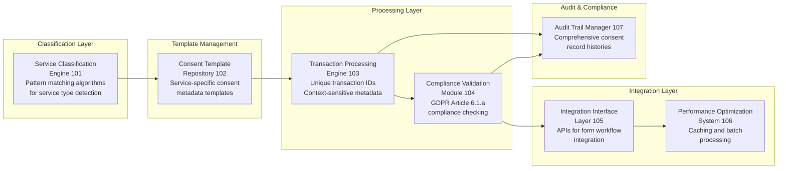

**Figure 1** is a block diagram showing the overall system architecture of the transaction-level granular consent management system, including:

- **Service Classification Engine (101)**: Component analyzing user interface interactions to automatically detect service types through pattern matching algorithms
- **Consent Template Repository (102)**: Database containing service-specific consent metadata templates with legal basis mappings and compliance requirements
- **Transaction Processing Engine (103)**: Core logic for generating unique transaction identifiers and context-sensitive consent metadata
- **Compliance Validation Module (104)**: System ensuring consent records meet GDPR Article 6.1.a and other regulatory requirements
- **Integration Interface Layer (105)**: APIs and connectors for seamless integration with existing form submission workflows
- **Performance Optimization System (106)**: Caching and batch processing components for high-volume application support
- **Audit Trail Manager (107)**: Component maintaining comprehensive consent record histories for regulatory compliance

## FIGURE 2: Service Type Detection Algorithm Flow

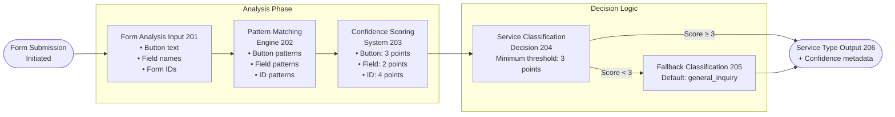

**Figure 2** is a flowchart diagram illustrating the automatic service type classification process:

- **Form Analysis Input (201)**: Initial analysis of form elements, submit button text, field names, and form identifiers
- **Pattern Matching Engine (202)**: Comparison of form characteristics against stored service type patterns
- **Confidence Scoring System (203)**: Algorithm assigning weighted scores to different pattern matches
- **Service Classification Decision (204)**: Selection of highest-confidence service type above minimum threshold
- **Fallback Classification (205)**: Default general inquiry classification when confidence scores are insufficient
- **Service Type Output (206)**: Final service classification with confidence metadata for consent template selection

## FIGURE 3: Transaction-Level Consent Metadata Structure

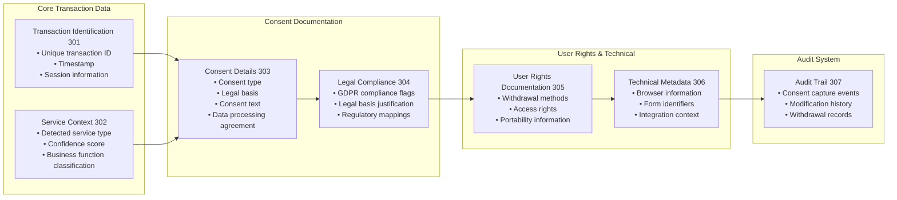

**Figure 3** shows the comprehensive data structure for individual consent records:

- **Transaction Identification Block (301)**: Unique transaction ID, timestamp, and session information
- **Service Context Block (302)**: Detected service type, confidence score, and business function classification
- **Consent Details Block (303)**: Consent type, legal basis, consent text, and data processing agreement
- **Legal Compliance Block (304)**: GDPR compliance flags, legal basis justification, and regulatory requirement mapping
- **User Rights Documentation (305)**: Withdrawal methods, access rights, portability information, and contact procedures
- **Technical Metadata Block (306)**: Browser information, form identifiers, and integration context
- **Audit Trail Block (307)**: Complete history of consent events including capture, modifications, and withdrawals

## FIGURE 4: Context-Sensitive Consent Generation Process

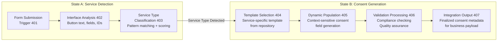

**Figure 4** illustrates the dynamic consent metadata generation workflow showing before and after states:

**State A (Service Detection):**
- **Form Submission Trigger (401)**: User initiates form submission process
- **Interface Analysis (402)**: System examines form elements and user interaction context
- **Service Type Classification (403)**: Automatic detection and confidence scoring of business function

**State B (Consent Generation):**
- **Template Selection (404)**: Retrieval of appropriate consent template based on detected service type
- **Dynamic Population (405)**: Context-sensitive filling of consent metadata fields
- **Validation Processing (406)**: Compliance checking and quality assurance for generated consent record
- **Integration Output (407)**: Finalized consent metadata ready for appending to business data payload

## FIGURE 5: Multi-Service Type Consent Template Repository

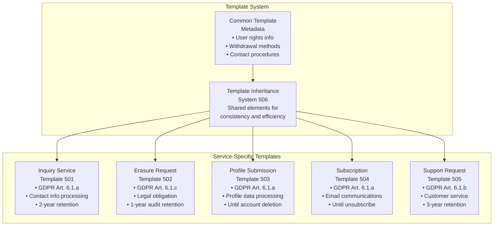

**Figure 5** demonstrates the structured consent template system for different business functions:

- **Inquiry Service Template (501)**: Consent template for contact forms and service inquiries
- **Erasure Request Template (502)**: GDPR Article 17 compliant template for data deletion requests
- **Profile Submission Template (503)**: Template for user profile creation and management
- **Subscription Template (504)**: Consent template for email subscriptions and marketing communications
- **Support Request Template (505)**: Template for customer service and technical support interactions
- **Template Inheritance System (506)**: Common elements shared across templates for consistency and efficiency

## FIGURE 6: Performance Optimization Architecture

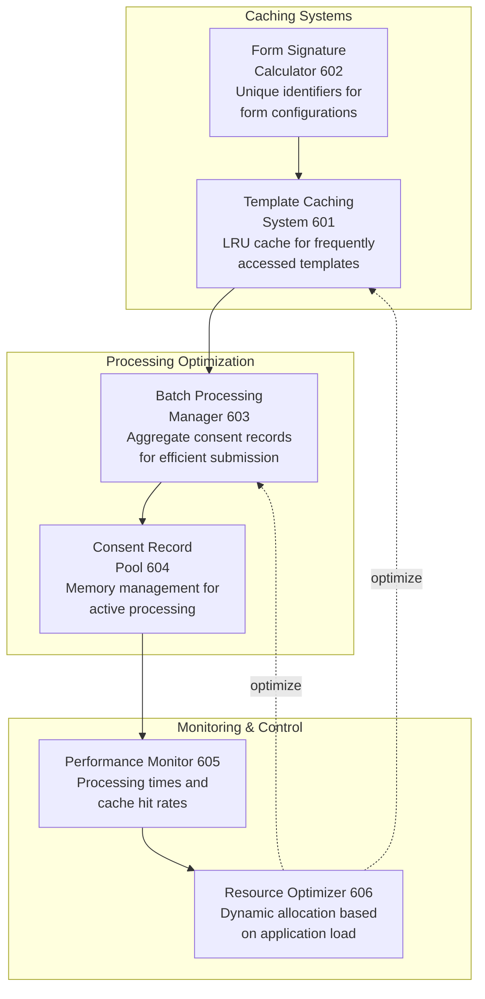

**Figure 6** shows the technical components for efficient consent processing in high-volume applications:

- **Template Caching System (601)**: LRU cache maintaining frequently accessed consent templates in memory
- **Form Signature Calculator (602)**: Algorithm generating unique identifiers for form configurations
- **Batch Processing Manager (603)**: Component aggregating multiple consent records for efficient backend submission
- **Consent Record Pool (604)**: Memory management system for active consent processing
- **Performance Monitor (605)**: Real-time tracking of consent generation processing times and cache hit rates
- **Resource Optimizer (606)**: Dynamic resource allocation based on application load and processing demands

## FIGURE 7: Integration Interface Patterns

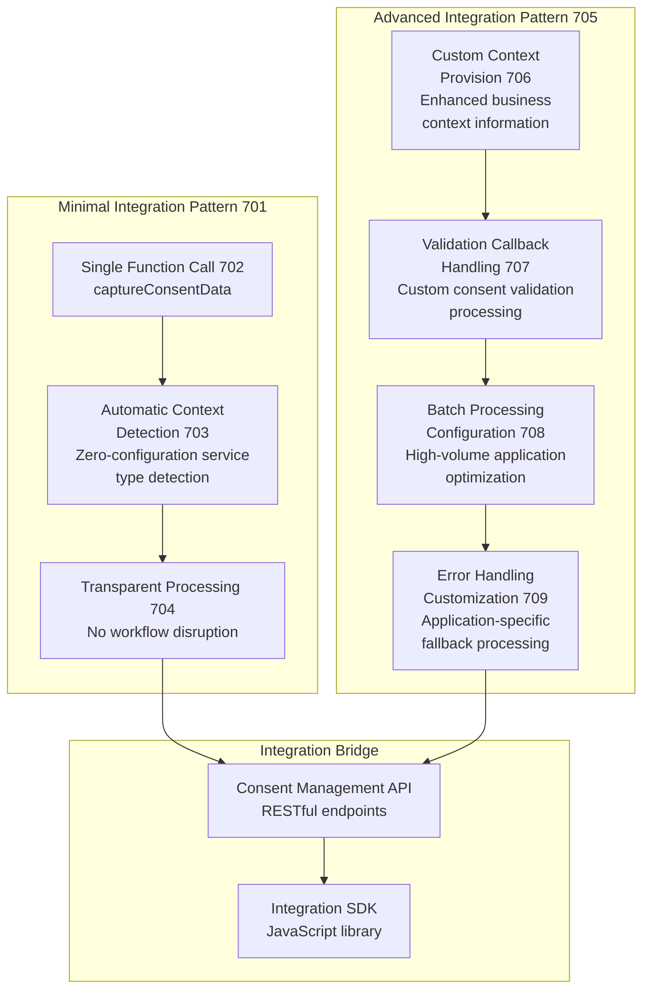

**Figure 7** illustrates how the consent system integrates with existing application workflows:

**Minimal Integration Pattern (701):**
- **Single Function Call (702)**: Simple captureConsentData integration with existing form handlers
- **Automatic Context Detection (703)**: Zero-configuration service type detection from form analysis
- **Transparent Processing (704)**: Consent metadata generation without disrupting user workflow

**Advanced Integration Pattern (705):**
- **Custom Context Provision (706)**: Enhanced integration with additional business context information
- **Validation Callback Handling (707)**: Custom processing of consent validation results and warnings
- **Batch Processing Configuration (708)**: Optimized integration for high-volume applications with batch submission
- **Error Handling Customization (709)**: Application-specific error handling and fallback consent processing

## FIGURE 8: Compliance Validation and Quality Assurance

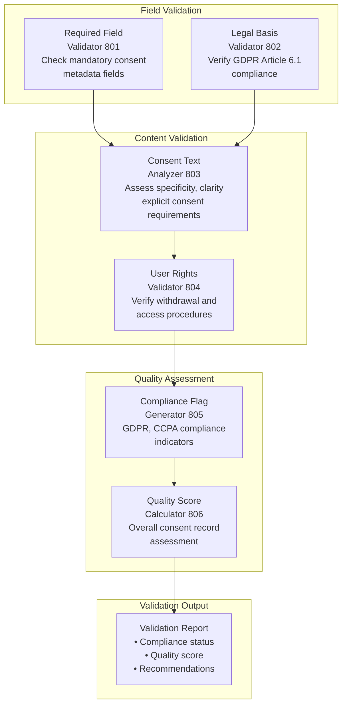

**Figure 8** shows the comprehensive validation system ensuring regulatory compliance:

- **Required Field Validator (801)**: Checking for presence and validity of all mandatory consent metadata fields
- **Legal Basis Validator (802)**: Verification of appropriate GDPR Article 6.1 legal basis selection for service type
- **Consent Text Analyzer (803)**: Assessment of consent language specificity, clarity, and explicit consent requirements
- **User Rights Validator (804)**: Verification of complete user rights documentation including withdrawal and access procedures
- **Compliance Flag Generator (805)**: Automatic assignment of GDPR, CCPA, and other regulatory compliance indicators
- **Quality Score Calculator (806)**: Overall consent record quality assessment for optimization and monitoring

## FIGURE 9: API Integration and Backend Connectivity

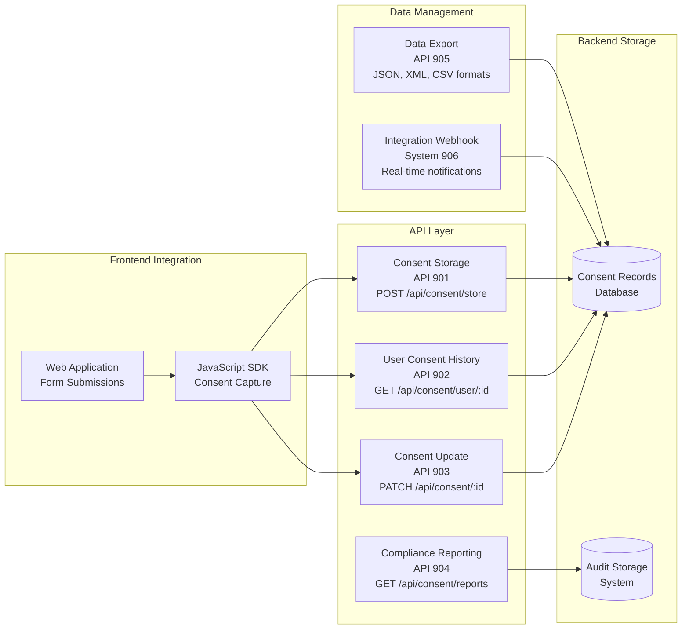

**Figure 9** illustrates the standardized interfaces for consent data management:

- **Consent Storage API (901)**: RESTful endpoints for storing transaction-level consent records
- **User Consent History API (902)**: Interface for retrieving user's complete consent record timeline
- **Consent Update API (903)**: Endpoints for processing consent modifications and withdrawal requests
- **Compliance Reporting API (904)**: Interface generating regulatory compliance reports and audit documentation
- **Data Export API (905)**: Standardized consent data export in JSON, XML, and CSV formats for portability
- **Integration Webhook System (906)**: Real-time notifications for consent events and compliance status changes

## FIGURE 10: Service Type Pattern Matching Algorithm

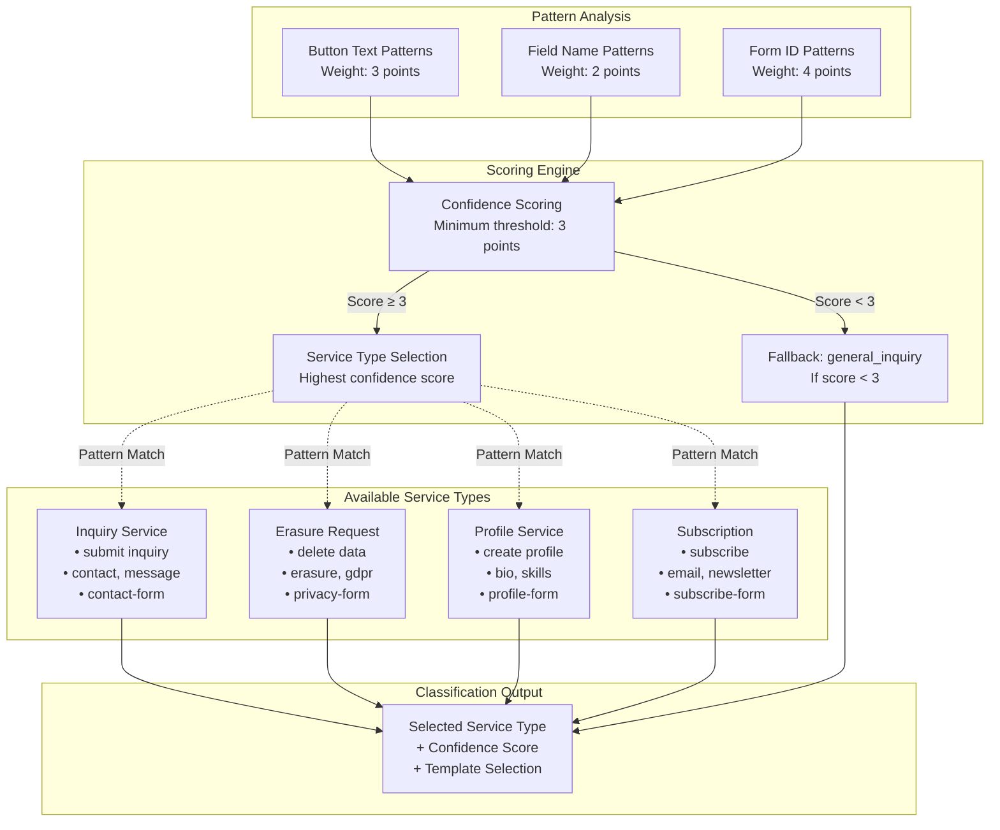

**Figure 10** demonstrates the detailed service type pattern matching algorithm showing how form elements are analyzed and weighted to determine the appropriate consent template:

- **Button Text Patterns**: Highest weight (3 points) given to submit button text analysis
- **Field Name Patterns**: Medium weight (2 points) for form field name analysis
- **Form ID Patterns**: Highest weight (4 points) for form identifier analysis
- **Confidence Scoring**: Minimum threshold of 3 points required for classification
- **Service Type Selection**: Highest scoring service type selected when threshold met
- **Fallback Classification**: Default to general_inquiry when confidence insufficient

## FIGURE 11: Consent Lifecycle Management

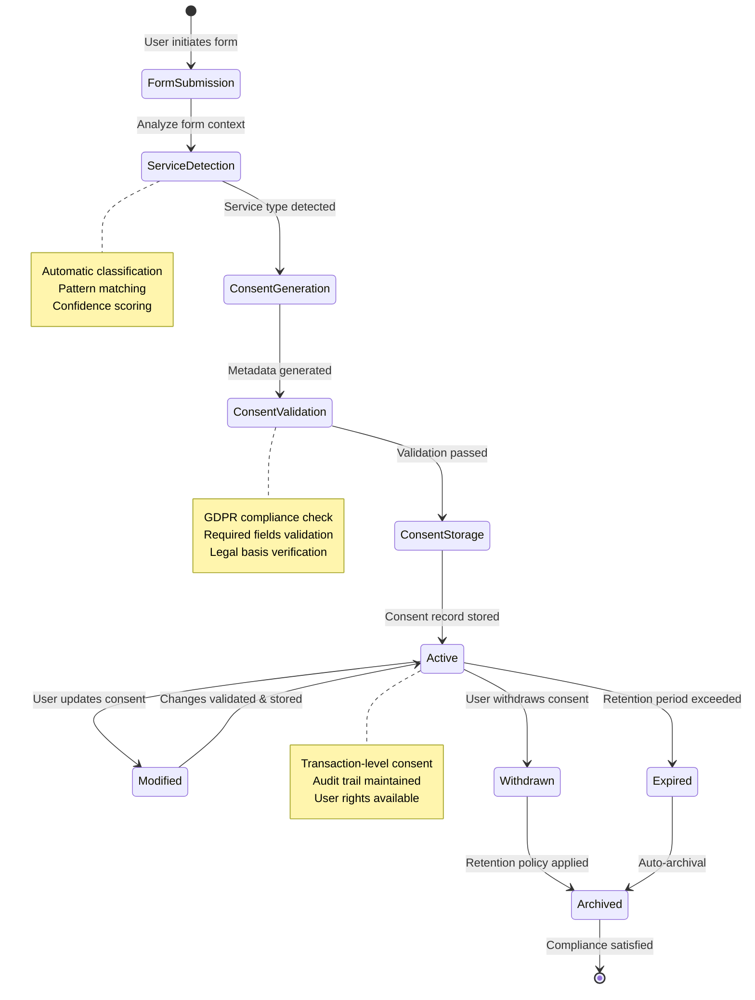

**Figure 11** illustrates the complete consent lifecycle from initial capture through final archival:

- **Form Submission**: User initiates form submission triggering consent processing
- **Service Detection**: Automatic classification of service type using pattern matching
- **Consent Generation**: Creation of service-specific consent metadata
- **Consent Validation**: GDPR compliance verification and quality assurance
- **Consent Storage**: Persistent storage of validated consent records
- **Active State**: Operational consent with full user rights and audit capabilities
- **Consent Modification**: User-initiated updates with validation and audit trail
- **Consent Withdrawal**: User rights fulfillment with appropriate retention policies
- **Consent Expiration**: Automated expiration based on retention periods
- **Archival**: Final state ensuring compliance requirements satisfied

## FIGURE 12: User Interface Integration Examples

**Figure 12** shows practical examples of consent system integration in common user interface patterns:

**Contact Form Integration (1201):**
- **Standard Contact Form (1202)**: Traditional inquiry form with name, email, and message fields
- **Transparent Consent Capture (1203)**: Invisible consent processing during form submission
- **Contextual Consent Display (1204)**: Optional consent summary presentation for user transparency

**Profile Creation Integration (1205):**
- **User Profile Form (1206)**: Registration form with personal and professional information fields
- **Multi-Step Consent Processing (1207)**: Sequential consent capture for different profile data types
- **Consent Confirmation Interface (1208)**: User-friendly presentation of granted consents and rights information

## FIGURE 13: Audit Trail and Consent Lifecycle Management

**Figure 13** demonstrates comprehensive consent record tracking and management:

- **Initial Consent Capture Event (1301)**: First consent record creation with complete metadata
- **Consent Modification Tracking (1302)**: Updates and changes to existing consent records with full audit trail
- **Consent Withdrawal Processing (1303)**: User-initiated consent withdrawal with retention policy application
- **Automated Consent Expiration (1304)**: System-managed consent record expiration based on retention periods
- **Compliance Audit Generation (1305)**: Automated creation of regulatory compliance documentation
- **Consent Analytics Dashboard (1306)**: Business intelligence interface showing consent patterns and compliance metrics

## FIGURE 14: Advanced Features and Extensions

**Figure 14** shows additional capabilities and system extensions:

**Machine Learning Enhancement (1401):**
- **Pattern Learning System (1402)**: ML algorithms improving service type detection accuracy over time
- **User Correction Integration (1403)**: Feedback loop incorporating user corrections to improve classification
- **Predictive Consent Optimization (1404)**: Intelligent suggestions for consent text and legal basis optimization

**Multi-Language and Localization (1405):**
- **Language Detection (1406)**: Automatic detection of user language preference from browser settings
- **Localized Consent Templates (1407)**: Language-specific consent text and legal requirement variations
- **Regional Compliance Adaptation (1408)**: Automatic adjustment of consent requirements based on user jurisdiction

**Enterprise Integration Features (1409):**
- **Single Sign-On Integration (1410)**: Connection with enterprise authentication and identity management systems
- **Role-Based Consent Management (1411)**: Different consent requirements and processing based on user roles
- **Organizational Policy Integration (1412)**: Automatic alignment with enterprise privacy policies and procedures

## DETAILED DESCRIPTION OF FIGURES

### Figure 1 - System Architecture Detail

The system architecture shown in Figure 1 represents a modular approach to consent management that separates concerns while maintaining efficient processing. The **Service Classification Engine (101)** implements the novel pattern matching algorithms that analyze user interface elements to determine business function context. The **Consent Template Repository (102)** stores service-specific templates that eliminate manual consent configuration requirements. The **Transaction Processing Engine (103)** generates unique identifiers and context-sensitive metadata for each user interaction, creating the granular consent tracking that distinguishes this invention from site-wide consent approaches.

### Figure 3 - Consent Metadata Structure Specifications

The transaction-level consent metadata structure illustrated in Figure 3 demonstrates the comprehensive information capture that enables regulatory compliance and user rights fulfillment. The **Transaction Identification Block (301)** provides unique tracking for each user interaction, while the **Service Context Block (302)** documents the automatic classification results. The **Legal Compliance Block (304)** ensures each consent record contains all elements required for GDPR Article 6(1)(a) compliance, including explicit legal basis justification and regulatory requirement mapping.

### Figure 4 - Dynamic Consent Generation Innovation

Figure 4 illustrates the key innovation of context-sensitive consent generation where the same form submission process can generate different consent metadata based on detected service type. The **Template Selection (404)** process automatically chooses appropriate legal basis, data processing purposes, and retention periods based on business function analysis, eliminating the manual configuration required by existing consent management platforms.

### Figure 6 - Performance Optimization Innovation

Figure 6 shows the novel performance optimization techniques that enable transaction-level consent processing without significant overhead. The **Template Caching System (601)** eliminates repeated template retrieval operations, while the **Form Signature Calculator (602)** enables intelligent reuse of consent templates for identical form configurations. The **Batch Processing Manager (603)** optimizes backend submission for high-volume applications while maintaining transaction-level granularity.

### Figure 10 - Service Type Pattern Matching Algorithm Detail

Figure 10 provides detailed illustration of the core innovation in automatic service type detection through weighted pattern matching. The **Button Text Patterns** carry the highest individual weight (3 points) as submit buttons often contain the most direct indication of user intent. **Form ID Patterns** receive maximum weight (4 points) as developers typically use semantic identifiers that directly indicate form purpose. The **Field Name Patterns** provide supplementary context with moderate weight (2 points). The **Confidence Scoring System** requires a minimum threshold of 3 points to proceed with automatic classification, ensuring reliable service type detection while providing fallback to general inquiry processing when confidence is insufficient.

### Figure 11 - Consent Lifecycle State Management Innovation

Figure 11 demonstrates the comprehensive state management system that tracks consent records from initial capture through final archival. The state diagram illustrates how the system maintains GDPR compliance throughout the entire consent lifecycle, including automatic expiration handling and user rights fulfillment. The **Active State** represents the core innovation where transaction-level consent records remain accessible for modification, withdrawal, and audit while maintaining complete historical tracking. The transition from **Active** to **Withdrawn** or **Expired** states demonstrates the system's ability to handle user rights requests and retention policy compliance automatically, distinguishing this invention from static consent management approaches.

## DRAWING STANDARDS AND CONVENTIONS

All figures follow USPTO drawing standards including:
- Black ink on white paper
- Clear, legible labeling with reference numerals
- Consistent scale and proportion across related figures
- Standard software engineering and system architecture symbology
- Clear distinction between data flows, system components, and user interfaces

## SOFTWARE INTERFACE MOCKUPS

While not required for provisional applications, the following interface mockups would accompany a full utility application:
- Screenshots of consent capture integration in typical web forms
- User interface examples showing consent transparency and user control features
- Developer integration examples demonstrating minimal code modifications required
- API documentation screenshots showing standardized consent management interfaces
- Compliance reporting dashboard examples with audit trail visualization

## SYSTEM INTERACTION DIAGRAMS

Additional figures would include detailed interaction diagrams showing:
- Sequence diagrams for consent capture, validation, and storage workflows
- State transition diagrams for consent lifecycle management
- Data flow diagrams showing information movement through system components
- Error handling flowcharts for consent processing failures and recovery
- Performance monitoring dashboards showing system efficiency metrics

## TECHNICAL IMPLEMENTATION EXAMPLES

Supplementary figures would demonstrate practical implementation scenarios:
- Code integration examples for different web application frameworks
- Database schema diagrams for consent record storage
- API request/response examples for consent management operations
- Configuration examples for different business types and compliance requirements
- Testing and validation interface examples for development and quality assurance

These figures collectively illustrate the comprehensive technical implementation of the transaction-level granular consent management system and demonstrate the novel approaches that distinguish this invention from existing consent management and privacy compliance solutions. The combination of automatic service type detection, context-sensitive consent generation, performance optimization, and seamless integration represents a significant advancement in consent management technology suitable for widespread adoption across consumer-facing web applications.